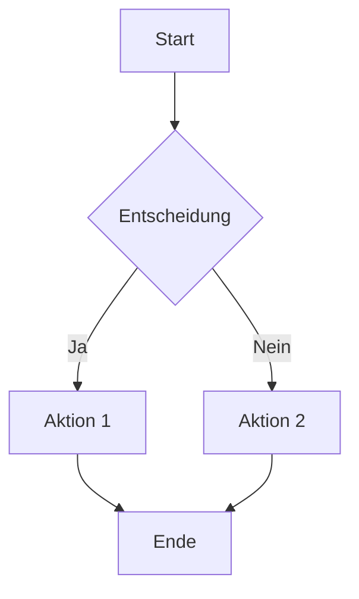
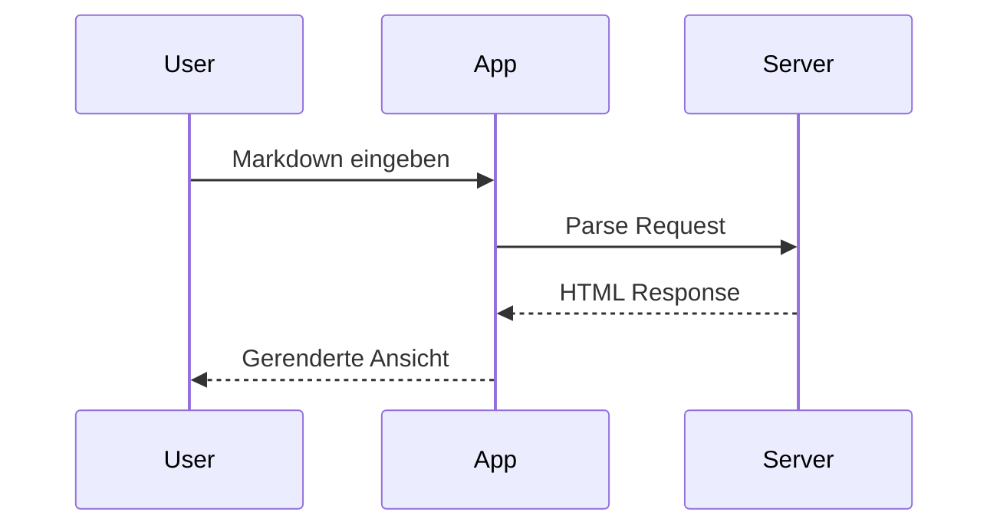
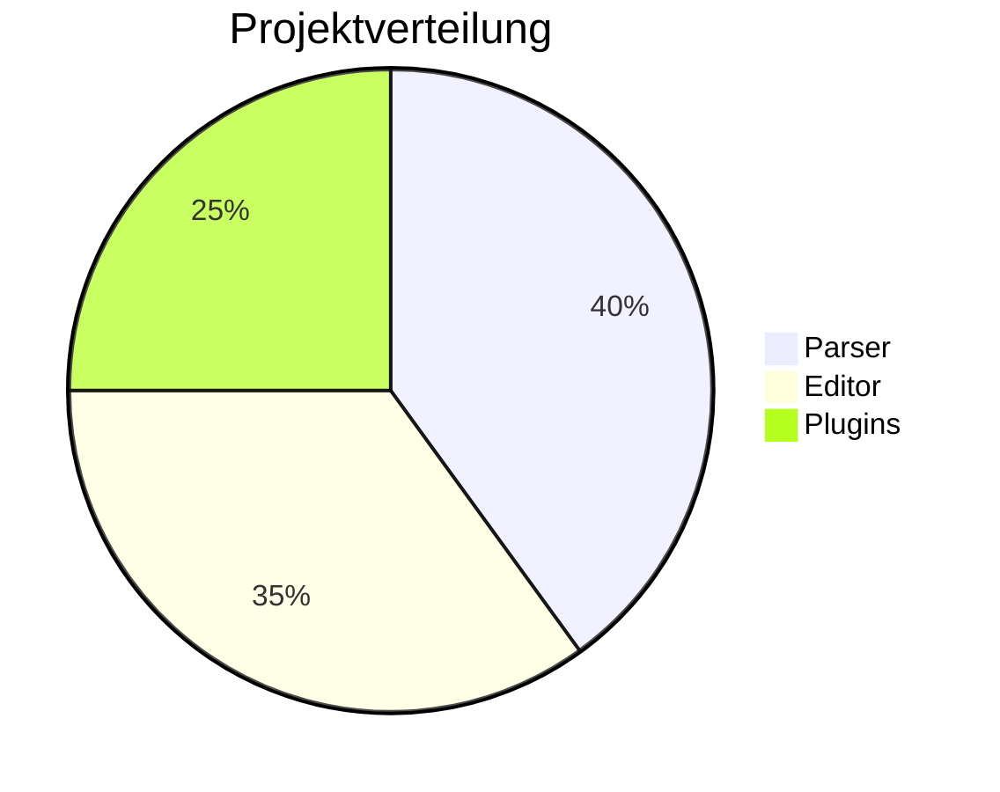

# MD++ Complete Demo

Dies ist eine umfassende Demonstration aller MD++ Features.

---

## 1. Standard Markdown

### Textformatierung

Dies ist **fett**, *kursiv*, ~~durchgestrichen~~ und `inline code`.

### Listen

- Ungeordnete Liste
- Noch ein Punkt
  - Verschachtelt
  - Noch einer

1. Nummerierte Liste
2. Zweiter Punkt
3. Dritter Punkt

### Task-Liste (GFM)

- [x] Erledigte Aufgabe
- [ ] Offene Aufgabe
- [ ] Noch eine offene

### Links und Bilder

[Link zu GitHub](https://github.com)


### Blockquote

> Dies ist ein Zitat.
> Es kann mehrere Zeilen haben.

### Code-Block

```javascript
function greet(name) {
  console.log(`Hallo, ${name}!`);
}
greet('Welt');
```

### Tabelle (GFM)

| Feature        | Status    | Priorität |
|----------------|-----------|-----------|
| Parser         | Fertig    | Hoch      |
| Editor         | In Arbeit | Mittel    |
| Plugins        | Geplant   | Niedrig   |

---

## 2. Component Directives

### Einfache Card

:::card{.shadow .rounded}
Dies ist eine **Card-Komponente** mit Schatten und abgerundeten Ecken.

Sie kann beliebigen Markdown-Inhalt enthalten.
:::

### Alert-Varianten

:::alert{variant="info"}
**Info:** Dies ist eine Informationsmeldung.
:::

:::alert{variant="warning"}
**Warnung:** Bitte beachten Sie diesen Hinweis.
:::

:::alert{variant="danger"}
**Fehler:** Etwas ist schiefgelaufen!
:::

:::alert{variant="success"}
**Erfolg:** Operation erfolgreich abgeschlossen.
:::

### Badge-Komponenten

Verfügbare Status: ::badge{variant="primary" text="Neu"} ::badge{variant="success" text="Aktiv"} ::badge{variant="warning" text="Ausstehend"}

### Verschachtelte Komponenten

:::card{.border}
#### Card mit verschachtelten Elementen

:::alert{variant="info"}
Diese Alert-Box ist innerhalb einer Card verschachtelt.
:::

- Liste innerhalb der Card
- Noch ein Punkt
:::

### Framework-spezifische Komponenten

:::bootstrap:container{.py-4}
#### Bootstrap Container

:::bootstrap:row
:::bootstrap:col{.col-md-6}
Linke Spalte
:::

:::bootstrap:col{.col-md-6}
Rechte Spalte
:::
:::
:::

### Leaf Directives (ohne Inhalt)

Hier kommt ein Trenner:

::divider{.my-4}

Und hier geht es weiter.

---

## 3. AI Context Blocks

### Versteckter Kontext (nur für AI)

:::ai-context{visibility=hidden}
## Projektkontext

Dieses Dokument ist eine Demo für MD++.
Der Benutzer ist ein Entwickler, der das Format lernen möchte.

### Wichtige Hinweise für AI:
- Erkläre Konzepte klar und verständlich
- Gib praktische Beispiele
- Verweise auf die Dokumentation bei Fragen
:::

### Sichtbarer Kontext

:::ai-context{visibility=visible}
**Kontext für Mensch und AI:**
Dieses Beispiel zeigt alle MD++ Features in einem Dokument.
:::

---

## 4. Callouts / Admonitions

> [!NOTE]
> Dies ist eine **Notiz** mit zusätzlichen Informationen.

> [!TIP]
> **Tipp:** Verwende Callouts für wichtige Hinweise!

> [!WARNING]
> **Warnung:** Sei vorsichtig mit diesem Feature.

> [!DANGER]
> **Gefahr:** Diese Aktion kann nicht rückgängig gemacht werden!

> [!INFO]
> Allgemeine Information für den Leser.

---

## 5. Mathematische Formeln (KaTeX)

### Inline-Mathe

Die berühmte Formel $E = mc^2$ von Einstein.

Der Satz des Pythagoras: $a^2 + b^2 = c^2$

### Display-Mathe

Die quadratische Formel:

$$
x = \frac{-b \pm \sqrt{b^2 - 4ac}}{2a}
$$

Eine Matrix:

$$
\begin{pmatrix}
a & b \\
c & d
\end{pmatrix}
$$

Summenformel:

$$
\sum_{i=1}^{n} i = \frac{n(n+1)}{2}
$$

---

## 6. Mermaid-Diagramme

### Flowchart



### Sequenzdiagramm



### Pie Chart



---

## 7. Footnotes

Hier ist ein Text mit einer Fußnote[^1] und noch einer[^2].

[^1]: Dies ist die erste Fußnote.
[^2]: Dies ist die zweite Fußnote mit mehr Details.

---

## 8. Heading Anchors

Alle Überschriften bekommen automatisch Anker-IDs:

- [Springe zu Standard Markdown](#1-standard-markdown)
- [Springe zu Callouts](#4-callouts--admonitions)
- [Springe zu Mermaid](#6-mermaid-diagramme)

---

## Zusammenfassung

| Feature | Syntax | Beschreibung |
|---------|--------|--------------|
| Directives | `:::name{attr}` | Komponenten-Blöcke |
| AI Context | `:::ai-context{visibility}` | KI-Kontext |
| Callouts | `> [!TYPE]` | Hervorgehobene Hinweise |
| Math | `$...$` / `$$...$$` | LaTeX-Formeln |
| Mermaid | ` ```mermaid ` | Diagramme |
| Footnotes | `[^n]` | Fußnoten |

---

*Erstellt mit MD++ - Markdown Plus Plus*
