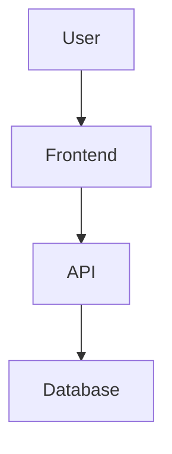

# MD++ Format Comparison

This document explains the three file formats supported by MD++.

---

## The Three Formats

| Extension | Format | Description |
|-----------|--------|-------------|
| `.md` | Standard Markdown | Basic markdown + GFM |
| `.md` / `.mdplus` | MD++ Enhanced | + Math, Mermaid, Components, AI Placeholders |
| `.mdsc` | MarkdownScript | + JavaScript, SCSS, Variables |

---

## Feature Matrix

| Feature | `.md` | `.mdplus` | `.mdsc` |
|---------|:-----:|:---------:|:-------:|
| Headings, Lists, Code | Yes | Yes | Yes |
| Tables (GFM) | Yes | Yes | Yes |
| Task Lists (GFM) | Yes | Yes | Yes |
| Math/LaTeX | - | Yes | Yes |
| Mermaid Diagrams | - | Yes | Yes |
| Components (:::card) | - | Yes | Yes |
| Callouts (> [!NOTE]) | - | Yes | Yes |
| AI Context | - | Yes | Yes |
| AI Placeholders | - | Yes | Yes |
| JavaScript (:::script) | - | - | Yes |
| SCSS/CSS (:::style) | - | - | Yes |
| Variable Interpolation | - | - | Yes |

---

## Examples by Format

### 1. Standard Markdown (`.md`)

```markdown
# My Document

This is **bold** and *italic* text.

- List item 1
- List item 2

| Column A | Column B |
|----------|----------|
| Data 1   | Data 2   |
```

**Use for:** Simple documentation, READMEs, notes

---

### 2. MD++ Enhanced (`.md` with features)

```markdown
# Product Documentation

## Architecture



## Math

The quadratic formula: $x = \frac{-b \pm \sqrt{b^2-4ac}}{2a}$

## Components

:::card{.shadow}
This is a styled card component.
:::

## AI Placeholders

:::ai-generate{prompt="Write product overview"}
:::

The product was released in :ai{prompt="release year"}.

> [!TIP]
> Use callouts for important information!
```

**Use for:** Technical docs, product pages, content with AI assistance

---

### 3. MarkdownScript (`.mdsc`)

```markdown
---
title: Sales Report
---

# {{document.title}}

:::script{lang="js"}
const sales = [
  { month: 'Jan', revenue: 45000 },
  { month: 'Feb', revenue: 52000 },
  { month: 'Mar', revenue: 48000 },
];

const total = sales.reduce((s, r) => s + r.revenue, 0);
$$('salesData', sales);
$$('totalRevenue', total);
:::

## Revenue Overview

:::script:output{lang="js"}
return utils.table(
  ['Month', 'Revenue'],
  sales.map(s => [s.month, utils.currency(s.revenue)])
);
:::

**Total Revenue:** :::script:output{lang="js"}
return utils.currency($('totalRevenue'));
:::

## AI Analysis

:::ai-generate{prompt="Analyze this sales data and provide recommendations: {{salesData}}"}
:::

:::style{lang="scss"}
.highlight {
  background: yellow;
  padding: 0.5rem;

  &.important {
    border-left: 4px solid red;
  }
}
:::
```

**Use for:** Dynamic reports, data-driven docs, templates, dashboards

---

## API Usage

```typescript
import { MDPlusPlus, detectFileFormat } from 'mdplusplus';

const parser = new MDPlusPlus();

// Auto-detect format from filename
const result = await parser.convertWithFormat(content, 'report.mdsc');
// result.format === 'mdsc'
// result.scripts contains extracted scripts
// result.placeholders contains AI placeholders
// result.styles contains SCSS blocks

// Or detect manually
const format = detectFileFormat('document.md');    // 'md'
const format2 = detectFileFormat('report.mdsc');   // 'mdsc'

// Get capabilities
const caps = MDPlusPlus.getCapabilities('mdsc');
console.log(caps.scripts);  // true
console.log(caps.styles);   // true
```

---

## When to Use Each Format

| Scenario | Recommended Format |
|----------|-------------------|
| Simple README | `.md` |
| API Documentation | `.md` or `.mdplus` |
| Blog with diagrams | `.mdplus` |
| Product page with AI | `.mdplus` |
| Dynamic report | `.mdsc` |
| Data dashboard | `.mdsc` |
| Template with variables | `.mdsc` |
| Interactive tutorial | `.mdsc` |

---

*Created with MD++ - The future of Markdown*
