# Willkommen bei MD++ 🚀

MD++ ist ein erweiterter Markdown-Editor mit vielen zusätzlichen Features.

---

## Überschriften

MD++ unterstützt alle Standard-Überschriften:

# H1 - Hauptüberschrift
## H2 - Abschnittsüberschrift
### H3 - Unterabschnitt
#### H4 - Kleinere Überschrift
##### H5 - Noch kleiner
###### H6 - Kleinste Überschrift

---

## Textformatierung

- **Fetter Text** mit `**text**`
- *Kursiver Text* mit `*text*`
- ***Fett und kursiv*** mit `***text***`
- ~~Durchgestrichen~~ mit `~~text~~`
- `Inline-Code` mit Backticks

---

## Listen

### Ungeordnete Liste
- Erster Punkt
- Zweiter Punkt
  - Verschachtelt
  - Noch einer
- Dritter Punkt

### Geordnete Liste
1. Schritt eins
2. Schritt zwei
3. Schritt drei

### Aufgabenliste
- [x] Erledigt
- [x] Auch erledigt
- [ ] Noch offen
- [ ] In Arbeit

---

## Tabellen

| Feature | Status | Beschreibung |
|:--------|:------:|-------------:|
| Parser | ✅ | Vollständig |
| Editor | ✅ | Mit Syntax-Highlighting |
| Preview | ✅ | Live-Vorschau |
| Export | 🔄 | In Entwicklung |

---

## Code-Blöcke

### JavaScript
```javascript
function greet(name) {
  console.log(`Hallo, ${name}!`);
  return true;
}

const result = greet('MD++');
```

### TypeScript
```typescript
interface User {
  name: string;
  age: number;
}

const user: User = { name: 'Max', age: 30 };
```

### Python
```python
def fibonacci(n):
    if n <= 1:
        return n
    return fibonacci(n-1) + fibonacci(n-2)

print([fibonacci(i) for i in range(10)])
```

---

## Mathematische Formeln

### Inline-Mathe
Die berühmte Formel $E = mc^2$ von Einstein.

Brüche: $\frac{a}{b}$ und griechische Buchstaben: $\alpha$, $\beta$, $\gamma$

### Block-Mathe
$$
\sum_{i=1}^{n} i = \frac{n(n+1)}{2}
$$

$$
\int_{0}^{\infty} e^{-x^2} dx = \frac{\sqrt{\pi}}{2}
$$

---

## Diagramme (Mermaid)

### Flowchart


### Sequenzdiagramm

```mermaid
sequenceDiagram
    User->>App: Öffnet Datei
    App->>Parser: Konvertiert MD
    Parser-->>App: HTML zurück
    App-->>User: Zeigt Vorschau
```


---

## Admonitions (Hinweisboxen)

:::note
**Hinweis:** Dies ist eine informative Notiz.
:::

:::tip
**Tipp:** Nutzen Sie Tastenkürzel für schnelleres Arbeiten!
:::

:::warning
**Warnung:** Speichern Sie regelmäßig Ihre Arbeit.
:::

:::danger
**Gefahr:** Diese Aktion kann nicht rückgängig gemacht werden!
:::

:::success
**Erfolg:** Die Datei wurde erfolgreich gespeichert.
:::

---

## GitHub-Style Callouts

> [!NOTE]
> Dies ist ein GitHub-style Hinweis.

> [!TIP]
> Ein hilfreicher Tipp für Benutzer.

> [!WARNING]
> Eine wichtige Warnung.

---

## Zitate

> "Markdown ist eine einfache Möglichkeit, Text zu formatieren."
>
> — John Gruber, Erfinder von Markdown

---

## Links und Bilder

[Besuchen Sie GitHub](https://github.com)

Automatische Links: https://example.com

---

## Fußnoten

MD++ unterstützt Fußnoten[^1] für zusätzliche Informationen[^2].

[^1]: Dies ist die erste Fußnote.
[^2]: Fußnoten erscheinen am Ende des Dokuments.

---

## Horizontale Linien

Horizontale Linien sind visuelle **Trennstriche**, die Abschnitte voneinander separieren.
Du siehst sie als farbige Linien zwischen den Abschnitten dieser Seite.

Es gibt drei Syntaxen (alle erzeugen das gleiche Ergebnis):

**Syntax 1:** Drei Bindestriche
```markdown
---
```

**Syntax 2:** Drei Sternchen
```markdown
***
```

**Syntax 3:** Drei Unterstriche
```markdown
___
```

Hier sind alle drei direkt hintereinander als Beispiel:

---

***

___

---

## Tastenkürzel

| Aktion | Tastenkürzel |
|--------|-------------|
| Speichern | `Ctrl+S` |
| Öffnen | `Ctrl+O` |
| Neue Datei | `Ctrl+N` |
| AI-Kontext anzeigen | `Ctrl+Shift+A` |
| Theme wechseln | In Toolbar |

---

*Erstellt mit MD++ - Der erweiterte Markdown-Editor*
