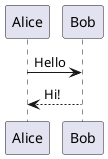
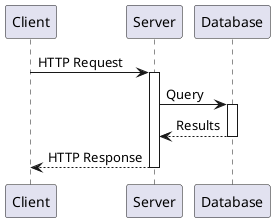
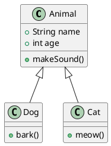
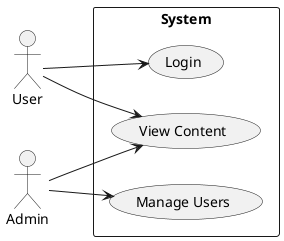
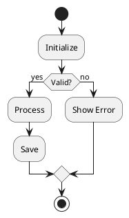
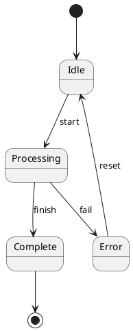
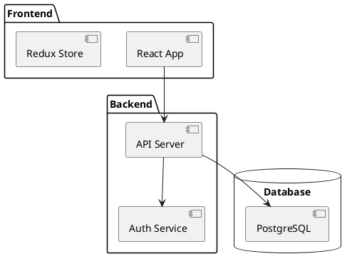
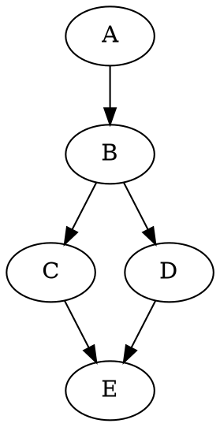
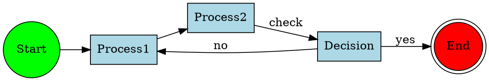
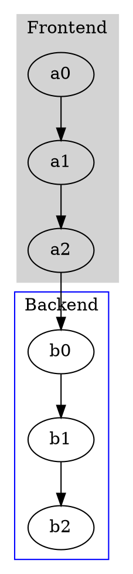

# Kroki Diagrams Syntax Reference

## Basic Usage

Use fenced code blocks with the diagram language as identifier:

````markdown

````

**Result:**


---

## PlantUML

Full UML diagramming language.

### Sequence Diagram

````markdown

````

**Result:**


### Class Diagram

````markdown

````

**Result:**


### Use Case Diagram

````markdown

````

**Result:**


### Activity Diagram

````markdown

````

**Result:**


### State Diagram

````markdown

````

**Result:**


### Component Diagram

````markdown

````

**Result:**


---

## Graphviz / DOT

Graph visualization language.

### Basic Graph

````markdown

````

**Result:**


### Styled Graph

````markdown

````

**Result:**


### Subgraphs/Clusters

````markdown

````

**Result:**


### Node Shapes

````markdown
```graphviz
digraph shapes {
  box [shape=box]
  circle [shape=circle]
  diamond [shape=diamond]
  ellipse [shape=ellipse]
  hexagon [shape=hexagon]
  octagon [shape=octagon]
  parallelogram [shape=parallelogram]
  trapezium [shape=trapezium]
  cylinder [shape=cylinder]
  note [shape=note]
  folder [shape=folder]
  component [shape=component]
}
```
````

**Result:**

```graphviz
digraph shapes {
  box [shape=box]
  circle [shape=circle]
  diamond [shape=diamond]
  ellipse [shape=ellipse]
  hexagon [shape=hexagon]
  octagon [shape=octagon]
  parallelogram [shape=parallelogram]
  trapezium [shape=trapezium]
  cylinder [shape=cylinder]
  note [shape=note]
  folder [shape=folder]
  component [shape=component]
}
```

---

## D2

Modern declarative diagramming language.

### Basic Diagram

````markdown
```d2
x -> y: connection
y -> z
```
````

**Result:**

```d2
x -> y: connection
y -> z
```

### Styled Diagram

````markdown
```d2
direction: right

server: Backend Server {
  api: REST API
  db: Database
}

client: Frontend {
  web: Web App
  mobile: Mobile App
}

client.web -> server.api: HTTPS
client.mobile -> server.api: HTTPS
server.api -> server.db: SQL
```
````

**Result:**

```d2
direction: right

server: Backend Server {
  api: REST API
  db: Database
}

client: Frontend {
  web: Web App
  mobile: Mobile App
}

client.web -> server.api: HTTPS
client.mobile -> server.api: HTTPS
server.api -> server.db: SQL
```

### Containers

````markdown
```d2
cloud: Cloud Platform {
  vpc: VPC {
    public: Public Subnet {
      lb: Load Balancer
    }
    private: Private Subnet {
      app: App Servers
      db: Database
    }
  }
}

cloud.vpc.public.lb -> cloud.vpc.private.app
cloud.vpc.private.app -> cloud.vpc.private.db
```
````

**Result:**

```d2
cloud: Cloud Platform {
  vpc: VPC {
    public: Public Subnet {
      lb: Load Balancer
    }
    private: Private Subnet {
      app: App Servers
      db: Database
    }
  }
}

cloud.vpc.public.lb -> cloud.vpc.private.app
cloud.vpc.private.app -> cloud.vpc.private.db
```

### Icons and Shapes

````markdown
```d2
user: User {
  shape: person
}

server: Server {
  shape: cylinder
}

cloud: Cloud {
  shape: cloud
}

user -> server -> cloud
```
````

**Result:**

```d2
user: User {
  shape: person
}

server: Server {
  shape: cylinder
}

cloud: Cloud {
  shape: cloud
}

user -> server -> cloud
```

---

## C4 PlantUML

C4 model for software architecture.

### Context Diagram

````markdown
```c4plantuml
@startuml
!include https://raw.githubusercontent.com/plantuml-stdlib/C4-PlantUML/master/C4_Context.puml

Person(user, "User", "A user of the system")
System(system, "My System", "The system being designed")
System_Ext(email, "Email System", "External email service")

Rel(user, system, "Uses")
Rel(system, email, "Sends emails using")
@enduml
```
````

**Result:**

```c4plantuml
@startuml
!include https://raw.githubusercontent.com/plantuml-stdlib/C4-PlantUML/master/C4_Context.puml

Person(user, "User", "A user of the system")
System(system, "My System", "The system being designed")
System_Ext(email, "Email System", "External email service")

Rel(user, system, "Uses")
Rel(system, email, "Sends emails using")
@enduml
```

### Container Diagram

````markdown
```c4plantuml
@startuml
!include https://raw.githubusercontent.com/plantuml-stdlib/C4-PlantUML/master/C4_Container.puml

Person(user, "User")

System_Boundary(system, "My System") {
  Container(web, "Web App", "React", "User interface")
  Container(api, "API", "Node.js", "Business logic")
  ContainerDb(db, "Database", "PostgreSQL", "Data storage")
}

Rel(user, web, "Uses")
Rel(web, api, "API calls")
Rel(api, db, "Reads/Writes")
@enduml
```
````

**Result:**

```c4plantuml
@startuml
!include https://raw.githubusercontent.com/plantuml-stdlib/C4-PlantUML/master/C4_Container.puml

Person(user, "User")

System_Boundary(system, "My System") {
  Container(web, "Web App", "React", "User interface")
  Container(api, "API", "Node.js", "Business logic")
  ContainerDb(db, "Database", "PostgreSQL", "Data storage")
}

Rel(user, web, "Uses")
Rel(web, api, "API calls")
Rel(api, db, "Reads/Writes")
@enduml
```

---

## Structurizr

Structurizr DSL for C4 diagrams.

````markdown
```structurizr
workspace {
  model {
    user = person "User"
    softwareSystem = softwareSystem "Software System" {
      webapp = container "Web Application"
      database = container "Database"
    }

    user -> webapp "Uses"
    webapp -> database "Reads/Writes"
  }

  views {
    container softwareSystem {
      include *
      autoLayout
    }
  }
}
```
````

**Result:**

```structurizr
workspace {
  model {
    user = person "User"
    softwareSystem = softwareSystem "Software System" {
      webapp = container "Web Application"
      database = container "Database"
    }

    user -> webapp "Uses"
    webapp -> database "Reads/Writes"
  }

  views {
    container softwareSystem {
      include *
      autoLayout
    }
  }
}
```

---

## BPMN

Business Process Model and Notation.

````markdown
```bpmn
<?xml version="1.0" encoding="UTF-8"?>
<definitions xmlns="http://www.omg.org/spec/BPMN/20100524/MODEL">
  <process id="process_1" isExecutable="false">
    <startEvent id="start"/>
    <task id="task1" name="Review Request"/>
    <exclusiveGateway id="gateway1"/>
    <task id="task2" name="Approve"/>
    <task id="task3" name="Reject"/>
    <endEvent id="end"/>

    <sequenceFlow sourceRef="start" targetRef="task1"/>
    <sequenceFlow sourceRef="task1" targetRef="gateway1"/>
    <sequenceFlow sourceRef="gateway1" targetRef="task2"/>
    <sequenceFlow sourceRef="gateway1" targetRef="task3"/>
    <sequenceFlow sourceRef="task2" targetRef="end"/>
    <sequenceFlow sourceRef="task3" targetRef="end"/>
  </process>
</definitions>
```
````

**Result:**

```bpmn
<?xml version="1.0" encoding="UTF-8"?>
<definitions xmlns="http://www.omg.org/spec/BPMN/20100524/MODEL">
  <process id="process_1" isExecutable="false">
    <startEvent id="start"/>
    <task id="task1" name="Review Request"/>
    <exclusiveGateway id="gateway1"/>
    <task id="task2" name="Approve"/>
    <task id="task3" name="Reject"/>
    <endEvent id="end"/>

    <sequenceFlow sourceRef="start" targetRef="task1"/>
    <sequenceFlow sourceRef="task1" targetRef="gateway1"/>
    <sequenceFlow sourceRef="gateway1" targetRef="task2"/>
    <sequenceFlow sourceRef="gateway1" targetRef="task3"/>
    <sequenceFlow sourceRef="task2" targetRef="end"/>
    <sequenceFlow sourceRef="task3" targetRef="end"/>
  </process>
</definitions>
```

---

## Block Diagrams (blockdiag family)

### Block Diagram

````markdown
```blockdiag
blockdiag {
  A -> B -> C -> D
  A -> E -> F -> D
}
```
````

**Result:**

```blockdiag
blockdiag {
  A -> B -> C -> D
  A -> E -> F -> D
}
```

### Sequence Diagram

````markdown
```seqdiag
seqdiag {
  browser -> webserver [label = "GET /index.html"]
  webserver -> browser [label = "HTML"]
  browser -> webserver [label = "GET /style.css"]
  webserver -> browser [label = "CSS"]
}
```
````

**Result:**

```seqdiag
seqdiag {
  browser -> webserver [label = "GET /index.html"]
  webserver -> browser [label = "HTML"]
  browser -> webserver [label = "GET /style.css"]
  webserver -> browser [label = "CSS"]
}
```

### Activity Diagram

````markdown
```actdiag
actdiag {
  write -> convert -> review
  review -> publish [label = "approved"]
  review -> write [label = "rejected"]
}
```
````

**Result:**

```actdiag
actdiag {
  write -> convert -> review
  review -> publish [label = "approved"]
  review -> write [label = "rejected"]
}
```

### Network Diagram

````markdown
```nwdiag
nwdiag {
  network dmz {
    address = "210.x.x.x/24"
    web01 [address = "210.x.x.1"]
    web02 [address = "210.x.x.2"]
  }

  network internal {
    address = "172.x.x.x/24"
    web01 [address = "172.x.x.1"]
    db01 [address = "172.x.x.100"]
  }
}
```
````

**Result:**

```nwdiag
nwdiag {
  network dmz {
    address = "210.x.x.x/24"
    web01 [address = "210.x.x.1"]
    web02 [address = "210.x.x.2"]
  }

  network internal {
    address = "172.x.x.x/24"
    web01 [address = "172.x.x.1"]
    db01 [address = "172.x.x.100"]
  }
}
```

### Rack Diagram

````markdown
```rackdiag
rackdiag {
  16U
  1: UPS
  2: PDU
  3: Server1
  4: Server2
  5-8: Storage
}
```
````

**Result:**

```rackdiag
rackdiag {
  16U
  1: UPS
  2: PDU
  3: Server1
  4: Server2
  5-8: Storage
}
```

### Packet Diagram

````markdown
```packetdiag
packetdiag {
  0-15: Source Port
  16-31: Destination Port
  32-63: Sequence Number
  64-95: Acknowledgment Number
}
```
````

**Result:**

```packetdiag
packetdiag {
  0-15: Source Port
  16-31: Destination Port
  32-63: Sequence Number
  64-95: Acknowledgment Number
}
```

---

## ERD (Entity Relationship)

````markdown
```erd
[Customer]
*id
name
email

[Order]
*id
date
+customer_id

[Product]
*id
name
price

[OrderItem]
*id
+order_id
+product_id
quantity

Customer 1--* Order
Order 1--* OrderItem
Product 1--* OrderItem
```
````

**Result:**

```erd
[Customer]
*id
name
email

[Order]
*id
date
+customer_id

[Product]
*id
name
price

[OrderItem]
*id
+order_id
+product_id
quantity

Customer 1--* Order
Order 1--* OrderItem
Product 1--* OrderItem
```

---

## DBML (Database Markup Language)

````markdown
```dbml
Table users {
  id integer [primary key]
  username varchar
  email varchar
  created_at timestamp
}

Table posts {
  id integer [primary key]
  title varchar
  content text
  user_id integer
  created_at timestamp
}

Ref: posts.user_id > users.id
```
````

**Result:**

```dbml
Table users {
  id integer [primary key]
  username varchar
  email varchar
  created_at timestamp
}

Table posts {
  id integer [primary key]
  title varchar
  content text
  user_id integer
  created_at timestamp
}

Ref: posts.user_id > users.id
```

---

## Nomnoml

UML-like diagrams with simple syntax.

````markdown
```nomnoml
[Customer|name;email|placeOrder()]
[Order|date;total|process()]
[Product|name;price]

[Customer] 1 - * [Order]
[Order] * - * [Product]
```
````

**Result:**

```nomnoml
[Customer|name;email|placeOrder()]
[Order|date;total|process()]
[Product|name;price]

[Customer] 1 - * [Order]
[Order] * - * [Product]
```

---

## Ditaa

ASCII art to diagrams.

````markdown
```ditaa
+--------+   +-------+    +-------+
|        |   |       |    |       |
| Client +-->+ Proxy +--->+ Server|
|        |   |       |    |       |
+--------+   +-------+    +-------+
```
````

**Result:**

```ditaa
+--------+   +-------+    +-------+
|        |   |       |    |       |
| Client +-->+ Proxy +--->+ Server|
|        |   |       |    |       |
+--------+   +-------+    +-------+
```

---

## SVGBob

ASCII art to SVG.

````markdown
```svgbob
       .---.
      /-o-/--
   .-/ / /->
  ( *  \/
   '-.  \
      \ /
       '
```
````

**Result:**

```svgbob
       .---.
      /-o-/--
   .-/ / /->
  ( *  \/
   '-.  \
      \ /
       '
```

---

## WaveDrom

Digital timing diagrams.

````markdown
```wavedrom
{
  signal: [
    {name: 'clk', wave: 'p.....|...'},
    {name: 'dat', wave: 'x.345x|=.x', data: ['A','B','C','D']},
    {name: 'req', wave: '0.1..0|1.0'},
    {name: 'ack', wave: '1.....|01.'}
  ]
}
```
````

**Result:**

```wavedrom
{
  signal: [
    {name: 'clk', wave: 'p.....|...'},
    {name: 'dat', wave: 'x.345x|=.x', data: ['A','B','C','D']},
    {name: 'req', wave: '0.1..0|1.0'},
    {name: 'ack', wave: '1.....|01.'}
  ]
}
```

---

## Vega / Vega-Lite

Data visualizations.

### Vega-Lite Bar Chart

````markdown
```vegalite
{
  "$schema": "https://vega.github.io/schema/vega-lite/v5.json",
  "data": {
    "values": [
      {"category": "A", "value": 28},
      {"category": "B", "value": 55},
      {"category": "C", "value": 43}
    ]
  },
  "mark": "bar",
  "encoding": {
    "x": {"field": "category", "type": "nominal"},
    "y": {"field": "value", "type": "quantitative"}
  }
}
```
````

**Result:**

```vegalite
{
  "$schema": "https://vega.github.io/schema/vega-lite/v5.json",
  "data": {
    "values": [
      {"category": "A", "value": 28},
      {"category": "B", "value": 55},
      {"category": "C", "value": 43}
    ]
  },
  "mark": "bar",
  "encoding": {
    "x": {"field": "category", "type": "nominal"},
    "y": {"field": "value", "type": "quantitative"}
  }
}
```

### Vega-Lite Line Chart

````markdown
```vegalite
{
  "$schema": "https://vega.github.io/schema/vega-lite/v5.json",
  "data": {
    "values": [
      {"x": 1, "y": 10},
      {"x": 2, "y": 25},
      {"x": 3, "y": 15},
      {"x": 4, "y": 30}
    ]
  },
  "mark": "line",
  "encoding": {
    "x": {"field": "x", "type": "quantitative"},
    "y": {"field": "y", "type": "quantitative"}
  }
}
```
````

**Result:**

```vegalite
{
  "$schema": "https://vega.github.io/schema/vega-lite/v5.json",
  "data": {
    "values": [
      {"x": 1, "y": 10},
      {"x": 2, "y": 25},
      {"x": 3, "y": 15},
      {"x": 4, "y": 30}
    ]
  },
  "mark": "line",
  "encoding": {
    "x": {"field": "x", "type": "quantitative"},
    "y": {"field": "y", "type": "quantitative"}
  }
}
```

---

## Excalidraw

Hand-drawn style diagrams.

````markdown
```excalidraw
{
  "type": "excalidraw",
  "version": 2,
  "elements": [
    {
      "type": "rectangle",
      "x": 100,
      "y": 100,
      "width": 200,
      "height": 100,
      "strokeColor": "#000000",
      "backgroundColor": "#a5d8ff"
    },
    {
      "type": "text",
      "x": 150,
      "y": 140,
      "text": "Hello!",
      "fontSize": 20
    }
  ]
}
```
````

**Result:**

```excalidraw
{
  "type": "excalidraw",
  "version": 2,
  "elements": [
    {
      "type": "rectangle",
      "x": 100,
      "y": 100,
      "width": 200,
      "height": 100,
      "strokeColor": "#000000",
      "backgroundColor": "#a5d8ff"
    },
    {
      "type": "text",
      "x": 150,
      "y": 140,
      "text": "Hello!",
      "fontSize": 20
    }
  ]
}
```

---

## ByteField

Byte/bit field diagrams.

````markdown
```bytefield
(defattrs :bg-green {:fill "#a0ffa0"})
(defattrs :bg-yellow {:fill "#ffffa0"})
(defattrs :bg-pink {:fill "#ffb0a0"})

(draw-column-headers)
(draw-box "Version" [:box-first :bg-green])
(draw-box "IHL" [:box-last :bg-green])
(draw-box "DSCP" [:box-first :bg-yellow])
(draw-box "ECN" [:box-last :bg-yellow])
(draw-box "Total Length" {:span 16})
```
````

**Result:**

```bytefield
(defattrs :bg-green {:fill "#a0ffa0"})
(defattrs :bg-yellow {:fill "#ffffa0"})
(defattrs :bg-pink {:fill "#ffb0a0"})

(draw-column-headers)
(draw-box "Version" [:box-first :bg-green])
(draw-box "IHL" [:box-last :bg-green])
(draw-box "DSCP" [:box-first :bg-yellow])
(draw-box "ECN" [:box-last :bg-yellow])
(draw-box "Total Length" {:span 16})
```

---

## Pikchr

PIC-like diagram language.

````markdown
```pikchr
arrow right 200% "Input" "Program"
box rad 10px "Process" fit
arrow right 200% "Output"
```
````

**Result:**

```pikchr
arrow right 200% "Input" "Program"
box rad 10px "Process" fit
arrow right 200% "Output"
```

---

## TikZ

LaTeX TikZ graphics.

````markdown
```tikz
\begin{tikzpicture}
  \draw[thick,->] (0,0) -- (4,0) node[right] {$x$};
  \draw[thick,->] (0,0) -- (0,3) node[above] {$y$};
  \draw[domain=0:3.5,smooth,variable=\x,blue] plot ({\x},{\x*\x/4});
  \node at (2,2) {$y = x^2/4$};
\end{tikzpicture}
```
````

**Result:**

```tikz
\begin{tikzpicture}
  \draw[thick,->] (0,0) -- (4,0) node[right] {$x$};
  \draw[thick,->] (0,0) -- (0,3) node[above] {$y$};
  \draw[domain=0:3.5,smooth,variable=\x,blue] plot ({\x},{\x*\x/4});
  \node at (2,2) {$y = x^2/4$};
\end{tikzpicture}
```

---

## Best Practices

1. **Choose the right tool** - Each language has strengths
2. **Keep diagrams simple** - Avoid overcrowding
3. **Use subgraphs/clusters** - Group related elements
4. **Add labels** - Make relationships clear
5. **Test incrementally** - Build diagrams step by step
6. **Consider caching** - For frequently viewed diagrams
7. **Check server availability** - Public Kroki may have limits
