# Mermaid Syntax Reference

## Basic Usage

Wrap your Mermaid code in a fenced code block with `mermaid` as the language identifier:

````markdown
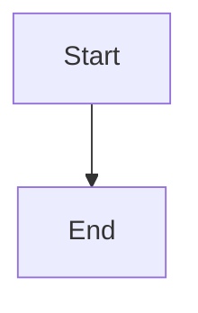
````

---

## Flowcharts

Flowcharts are the most common diagram type. Use `graph` or `flowchart` to define them.

### Direction

| Keyword | Direction |
|---------|-----------|
| `TB` / `TD` | Top to Bottom (default) |
| `BT` | Bottom to Top |
| `LR` | Left to Right |
| `RL` | Right to Left |

### Example

````markdown
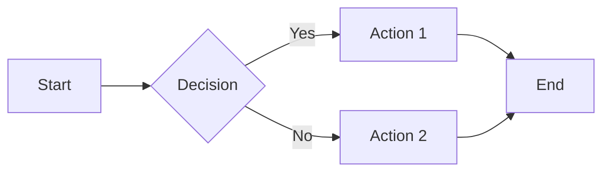
````

### Node Shapes

| Syntax | Shape | Description |
|--------|-------|-------------|
| `A[Text]` | Rectangle | Standard node |
| `A(Text)` | Rounded Rectangle | Soft edges |
| `A([Text])` | Stadium | Pill shape |
| `A[[Text]]` | Subroutine | Double border |
| `A[(Text)]` | Cylinder | Database symbol |
| `A((Text))` | Circle | Circular node |
| `A>Text]` | Asymmetric | Flag shape |
| `A{Text}` | Rhombus | Decision diamond |
| `A{{Text}}` | Hexagon | Six-sided |
| `A[/Text/]` | Parallelogram | Leaning right |
| `A[\Text\]` | Parallelogram Alt | Leaning left |
| `A[/Text\]` | Trapezoid | Wider top |
| `A[\Text/]` | Trapezoid Alt | Wider bottom |

### Link Styles

| Syntax | Description |
|--------|-------------|
| `A --> B` | Arrow |
| `A --- B` | Line (no arrow) |
| `A -.- B` | Dotted line |
| `A -.-> B` | Dotted arrow |
| `A ==> B` | Thick arrow |
| `A === B` | Thick line |
| `A --Text--> B` | Arrow with label |
| `A -->|Text| B` | Arrow with label (alt) |
| `A -.Text.-> B` | Dotted with label |

### Subgraphs

Group nodes into subgraphs:

````markdown
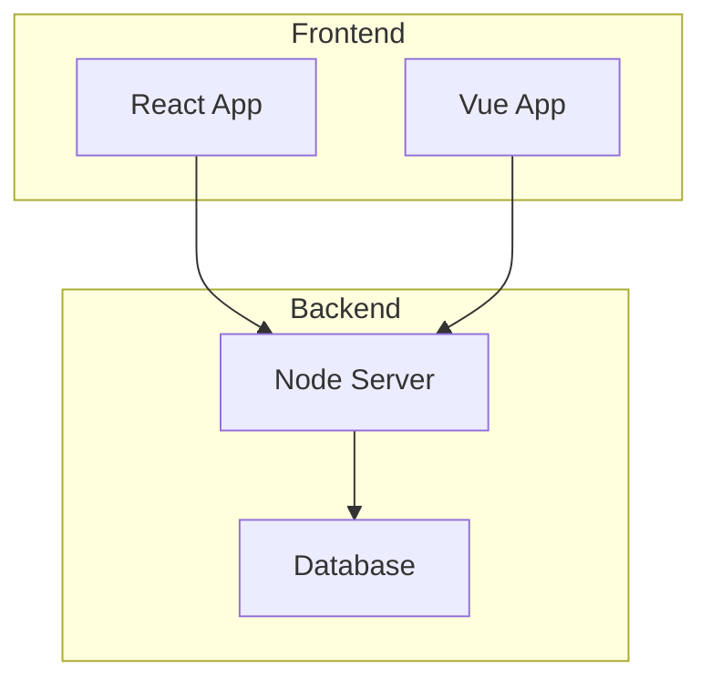
````

---

## Sequence Diagrams

Model interactions between participants over time.

### Basic Syntax

````markdown
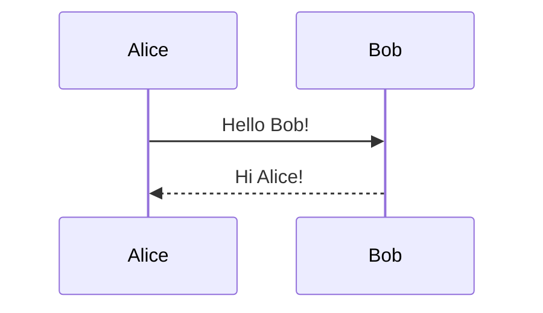
````

### Arrow Types

| Syntax | Description |
|--------|-------------|
| `->` | Solid line without arrow |
| `-->` | Dotted line without arrow |
| `->>` | Solid line with arrow |
| `-->>` | Dotted line with arrow |
| `-x` | Solid line with cross (async) |
| `--x` | Dotted line with cross |
| `-)` | Solid line with open arrow (async) |
| `--)` | Dotted line with open arrow |

### Activations

````markdown
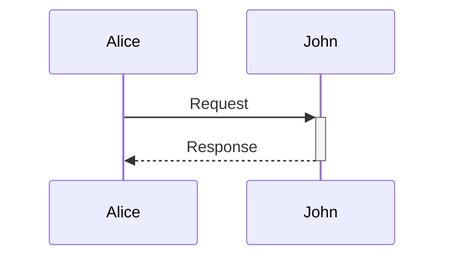
````

### Notes

````markdown
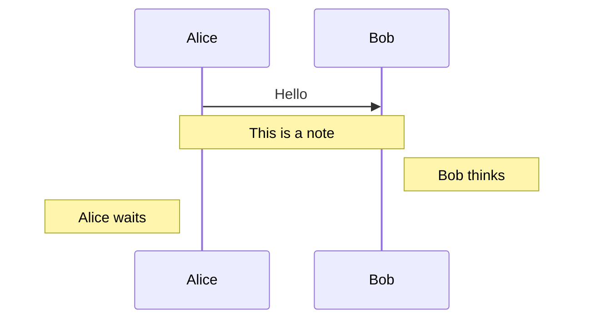
````

### Loops and Conditionals

````markdown
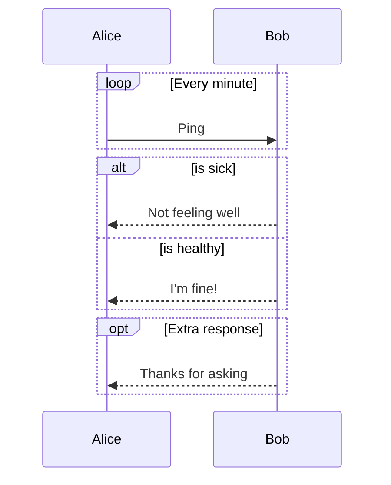
````

### Parallel Actions

````markdown
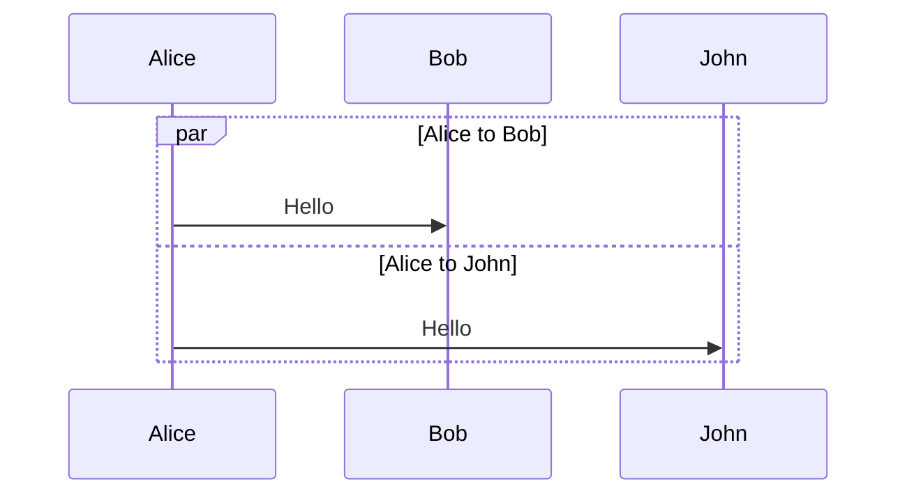
````

---

## Class Diagrams

Document object-oriented structures.

### Basic Class

````markdown
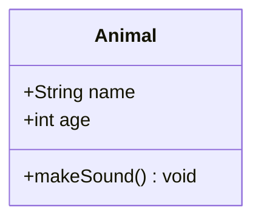
````

### Visibility Modifiers

| Symbol | Visibility |
|--------|------------|
| `+` | Public |
| `-` | Private |
| `#` | Protected |
| `~` | Package/Internal |

### Relationships

| Syntax | Relationship |
|--------|--------------|
| `<\|--` | Inheritance |
| `*--` | Composition |
| `o--` | Aggregation |
| `-->` | Association |
| `--` | Link (solid) |
| `..>` | Dependency |
| `..\|>` | Realization |
| `..` | Link (dashed) |

### Example

````markdown
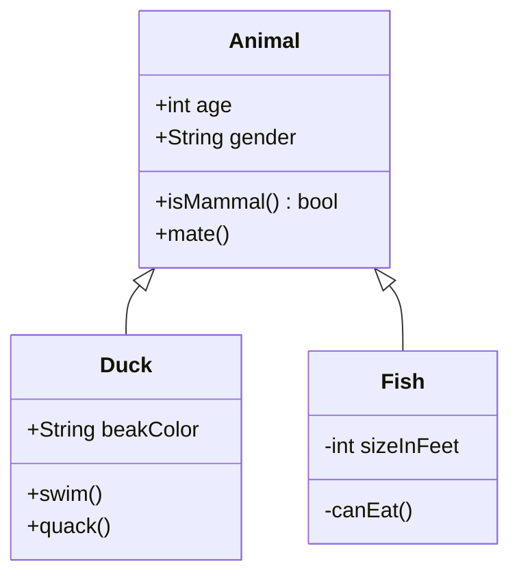
````

### Cardinality

````markdown
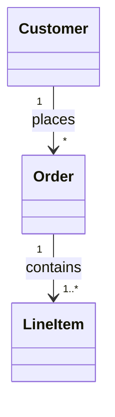
````

---

## State Diagrams

Model state machines and transitions.

### Basic States

````markdown
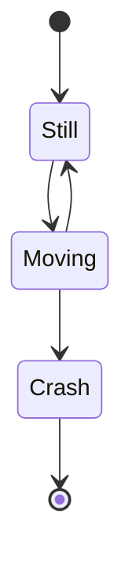
````

### State Descriptions

````markdown
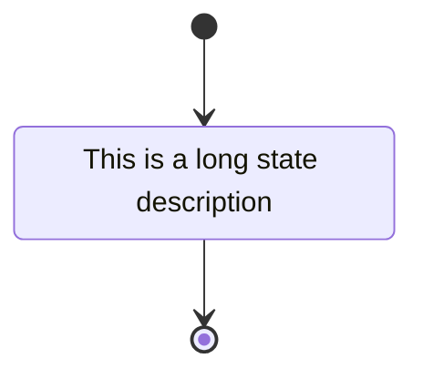
````

### Composite States

````markdown
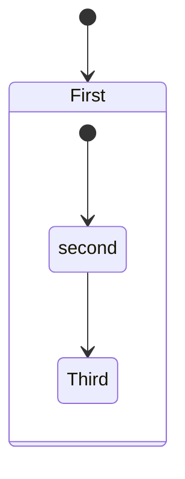
````

### Forks and Joins

````markdown
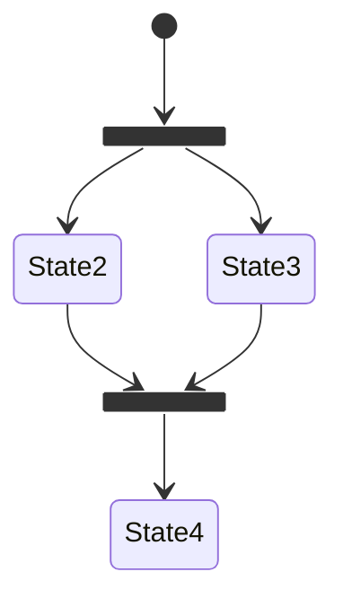
````

### Choice

````markdown
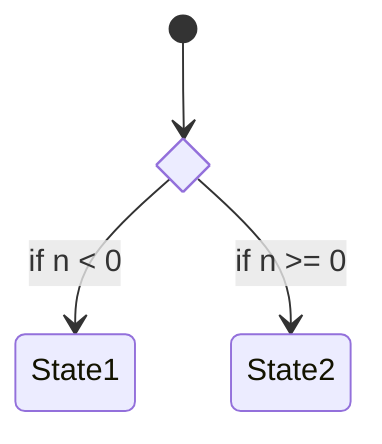
````

---

## Entity Relationship Diagrams

Design database schemas.

### Syntax

````markdown
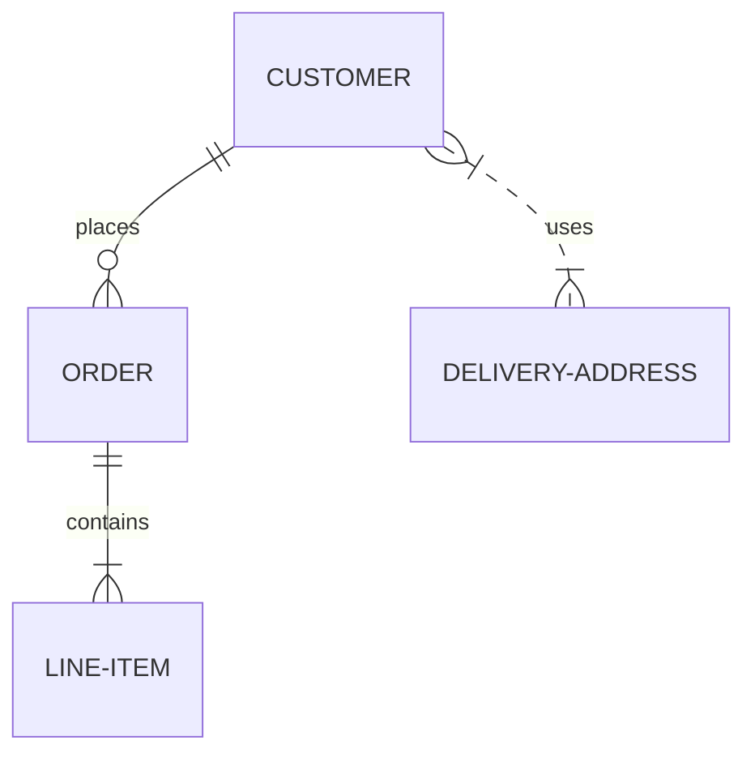
````

### Cardinality Notation

| Value (left) | Value (right) | Meaning |
|--------------|---------------|---------|
| `\|o` | `o\|` | Zero or one |
| `\|\|` | `\|\|` | Exactly one |
| `}o` | `o{` | Zero or more |
| `}\|` | `\|{` | One or more |

### Attributes

````markdown
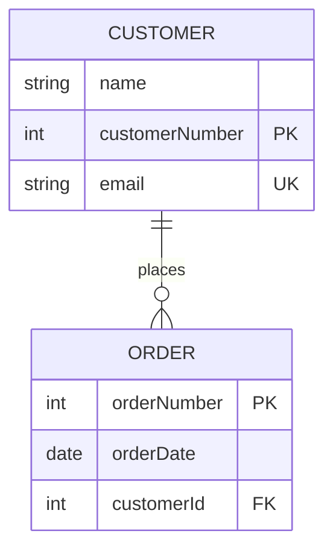
````

---

## Gantt Charts

Plan project timelines.

### Basic Syntax

````markdown
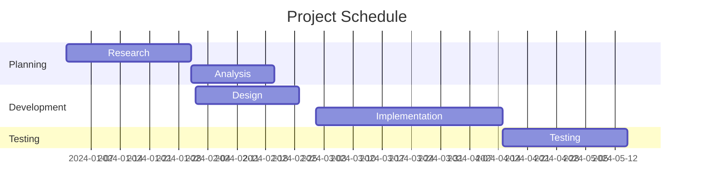
````

### Task Status

| Keyword | Description |
|---------|-------------|
| `done` | Completed task |
| `active` | Currently active |
| `crit` | Critical path |
| `milestone` | Project milestone |

### Example with Status

````markdown
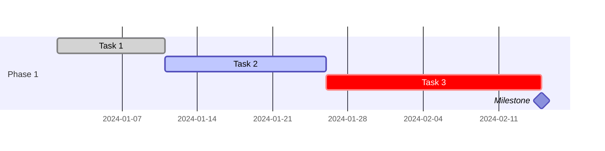
````

---

## Pie Charts

Display proportional data.

````markdown
```mermaid
pie title Distribution of Sales
    "Product A" : 42.5
    "Product B" : 27.3
    "Product C" : 18.2
    "Product D" : 12.0
```
````

### With showData

````markdown
```mermaid
pie showData
    title Pet Adoption
    "Dogs" : 386
    "Cats" : 285
    "Birds" : 150
```
````

---

## Git Graphs

Visualize branch histories.

````markdown
```mermaid
gitGraph
    commit id: "Initial"
    branch develop
    checkout develop
    commit id: "Feature 1"
    commit id: "Feature 2"
    checkout main
    merge develop id: "Merge develop"
    commit id: "Hotfix"
```
````

### Options

````markdown
```mermaid
gitGraph
    options
    {
        "nodeSpacing": 100,
        "nodeRadius": 10
    }
    end
    commit
    branch develop
    commit
```
````

---

## User Journey

Document user experiences.

````markdown
```mermaid
journey
    title My Working Day
    section Go to work
        Make tea: 5: Me
        Go upstairs: 3: Me
        Do work: 1: Me, Cat
    section Go home
        Go downstairs: 5: Me
        Sit down: 5: Me
```
````

The number represents satisfaction (1-5).

---

## Mindmaps

Organize hierarchical information.

````markdown
```mermaid
mindmap
    root((Central Topic))
        Branch 1
            Leaf 1.1
            Leaf 1.2
        Branch 2
            Leaf 2.1
            Leaf 2.2
                Sub-leaf
        Branch 3
```
````

### Node Shapes

| Syntax | Shape |
|--------|-------|
| `root` | Default |
| `root((text))` | Circle |
| `root)text(` | Bang |
| `root))text((` | Cloud |
| `root[text]` | Square |

---

## Timeline

Display chronological events.

````markdown
```mermaid
timeline
    title History of Technology
    2000 : First smartphone
    2007 : iPhone released
    2010 : iPad launched
    2020 : 5G rollout
```
````

### Sections

````markdown
```mermaid
timeline
    title Company Milestones
    section Foundation
        2010 : Company founded
        2011 : First product
    section Growth
        2015 : Series A funding
        2018 : International expansion
```
````

---

## Quadrant Charts

Plot data in four quadrants.

````markdown
```mermaid
quadrantChart
    title Priority Matrix
    x-axis Low Urgency --> High Urgency
    y-axis Low Impact --> High Impact
    quadrant-1 Do First
    quadrant-2 Schedule
    quadrant-3 Delegate
    quadrant-4 Eliminate

    Task A: [0.8, 0.9]
    Task B: [0.3, 0.7]
    Task C: [0.7, 0.3]
    Task D: [0.2, 0.2]
```
````

---

## XY Charts

Create line, bar, and scatter plots.

### Bar Chart

````markdown
```mermaid
xychart-beta
    title "Sales per Quarter"
    x-axis [Q1, Q2, Q3, Q4]
    y-axis "Revenue (thousands)" 0 --> 100
    bar [30, 45, 60, 80]
```
````

### Line Chart

````markdown
```mermaid
xychart-beta
    title "Temperature Trend"
    x-axis [Jan, Feb, Mar, Apr, May]
    y-axis "Temperature (C)" -10 --> 30
    line [5, 8, 15, 20, 25]
```
````

### Combined

````markdown
```mermaid
xychart-beta
    title "Performance Overview"
    x-axis [Jan, Feb, Mar, Apr]
    y-axis 0 --> 100
    bar [40, 55, 70, 85]
    line [30, 50, 65, 80]
```
````

---

## Styling

### Theme Configuration

````markdown
```mermaid
%%{init: {'theme': 'forest'}}%%
graph TD
    A --> B
```
````

Available themes: `default`, `dark`, `forest`, `neutral`, `base`

### Custom Styles

````markdown
```mermaid
graph TD
    A[Start]:::green --> B[End]:::red

    classDef green fill:#9f6,stroke:#333,stroke-width:2px
    classDef red fill:#f66,stroke:#333,stroke-width:2px
```
````

### Inline Styles

````markdown
```mermaid
graph TD
    A[Start] --> B[End]
    style A fill:#bbf,stroke:#333
    style B fill:#f9f,stroke:#f66
```
````

---

## Directive Syntax

You can also use MD++ directive syntax:

````markdown
:::mermaid
graph TD
    A --> B
:::
````

With attributes:

````markdown
:::mermaid{theme="dark"}
graph TD
    A --> B
:::
````

---

## Tips and Best Practices

1. **Keep diagrams simple** - Break complex diagrams into smaller ones
2. **Use subgraphs** - Group related nodes for better organization
3. **Add meaningful labels** - Make relationships clear with edge labels
4. **Choose the right diagram type** - Match the diagram to your data
5. **Test in Live Editor** - Use [Mermaid Live Editor](https://mermaid.live/) for complex diagrams
6. **Use themes** - Match the diagram theme to your document
