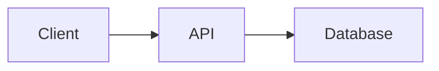

# Tailwind Components Syntax Reference

## Basic Directive Syntax

Use MD++ directive syntax with the `tailwind` framework prefix:

```markdown
:::tailwind:component-name{attributes}
Content here
:::
```

---

## Cards

Content containers with optional header and body sections.

### Basic Card

```markdown
:::tailwind:card
## Card Title

This is the card content. Cards have rounded corners,
shadows, and proper padding.
:::
```

### Card with Structure

```markdown
:::tailwind:card
:::tailwind:card-header
Card Header
:::

:::tailwind:card-body
This is the main content of the card.
You can include any Markdown here.
:::
:::
```

### Styled Output

Cards render with:
- White background (dark: gray-800)
- Rounded corners (lg)
- Drop shadow
- Padding (6)
- Bottom margin (4)

---

## Alerts

Notification and feedback messages.

### Alert Variants

```markdown
:::tailwind:alert{variant="info"}
This is an informational message.
:::

:::tailwind:alert{variant="success"}
Operation completed successfully!
:::

:::tailwind:alert{variant="warning"}
Please review before continuing.
:::

:::tailwind:alert{variant="error"}
An error occurred. Please try again.
:::

:::tailwind:alert{variant="default"}
This is a neutral message.
:::
```

### Alert Colors

| Variant | Light Mode | Dark Mode |
|---------|------------|-----------|
| `info` | Blue-100/800 | Blue-900/200 |
| `success` | Green-100/800 | Green-900/200 |
| `warning` | Yellow-100/800 | Yellow-900/200 |
| `error` | Red-100/800 | Red-900/200 |
| `default` | Gray-100/800 | Gray-700/200 |

### Alert with Markdown

```markdown
:::tailwind:alert{variant="info"}
## Important Notice

Please read the following carefully:

1. First point
2. Second point
3. Third point

[Learn more](#)
:::
```

---

## Badges

Small labels and tags for categorization.

### Badge Variants

```markdown
:::tailwind:badge{variant="primary"}
Primary
:::

:::tailwind:badge{variant="secondary"}
Secondary
:::

:::tailwind:badge{variant="success"}
Success
:::

:::tailwind:badge{variant="warning"}
Warning
:::

:::tailwind:badge{variant="danger"}
Danger
:::
```

### Inline Badges

```markdown
Status: :::tailwind:badge{variant="success"}Active:::

Version :::tailwind:badge{variant="primary"}2.0:::
```

### Badge Styling

Badges are styled with:
- Inline-flex display
- Rounded-full (pill shape)
- Small text (xs)
- Medium font weight
- Horizontal padding (2.5)
- Vertical padding (0.5)

---

## Buttons

Interactive button elements.

### Button Variants

```markdown
:::tailwind:button{variant="primary"}
Primary Button
:::

:::tailwind:button{variant="secondary"}
Secondary Button
:::

:::tailwind:button{variant="success"}
Success Button
:::

:::tailwind:button{variant="danger"}
Danger Button
:::

:::tailwind:button{variant="outline"}
Outline Button
:::
```

### Button Colors

| Variant | Background | Hover |
|---------|------------|-------|
| `primary` | Blue-600 | Blue-700 |
| `secondary` | Gray-200 | Gray-300 |
| `success` | Green-600 | Green-700 |
| `danger` | Red-600 | Red-700 |
| `outline` | Transparent + Border | Blue-50 |

### Button Styling

Buttons include:
- Horizontal padding (4)
- Vertical padding (2)
- Rounded corners (lg)
- Medium font weight
- Smooth color transition (200ms)
- Cursor pointer

---

## Containers

Centered content wrappers.

### Basic Container

```markdown
:::tailwind:container
Content is centered with horizontal padding.
:::
```

### Container Properties

- `container` class for max-width
- `mx-auto` for horizontal centering
- `px-4` for horizontal padding

---

## Grid Layouts

Responsive grid systems.

### Basic Grid

```markdown
:::tailwind:grid{variant="cols-2"}
:::tailwind:card
Column 1
:::

:::tailwind:card
Column 2
:::
:::
```

### Grid Variants

| Variant | Columns | Responsive |
|---------|---------|------------|
| `cols-2` | 2 columns | 1 col on mobile |
| `cols-3` | 3 columns | 2 on tablet, 1 on mobile |
| `cols-4` | 4 columns | 2 on tablet, 1 on mobile |

### Three Column Grid

```markdown
:::tailwind:grid{variant="cols-3"}
:::tailwind:card
Feature 1
:::

:::tailwind:card
Feature 2
:::

:::tailwind:card
Feature 3
:::
:::
```

### Four Column Grid

```markdown
:::tailwind:grid{variant="cols-4"}
Item 1
Item 2
Item 3
Item 4
:::
```

### Grid Styling

Grids include:
- `grid` display
- `gap-4` between items
- Responsive column classes

---

## Flex Layouts

Flexible box containers.

### Flex Variants

```markdown
:::tailwind:flex{variant="row"}
Horizontal items
:::

:::tailwind:flex{variant="col"}
Vertical items
:::

:::tailwind:flex{variant="center"}
Centered items
:::

:::tailwind:flex{variant="between"}
Space between items
:::

:::tailwind:flex{variant="wrap"}
Wrapping items
:::
```

### Flex Examples

#### Centered Content

```markdown
:::tailwind:flex{variant="center"}
:::tailwind:badge{variant="primary"}
Centered Badge
:::
:::
```

#### Space Between

```markdown
:::tailwind:flex{variant="between"}
Left content

Right content
:::
```

---

## Dividers

Horizontal separators.

```markdown
Content above

:::tailwind:divider
:::

Content below
```

### Divider Styling

- Horizontal rule
- Vertical margin (4)
- Gray border (200/700 dark)

---

## Quotes

Styled blockquotes.

```markdown
:::tailwind:quote
"The only way to do great work is to love what you do."
— Steve Jobs
:::
```

### Quote Styling

- Left border (4px, gray-300)
- Left padding (4)
- Vertical padding (2)
- Italic text
- Muted text color

---

## Code Blocks

Styled code containers.

```markdown
:::tailwind:code
function hello() {
  console.log("Hello, World!");
}
:::
```

### Code Styling

- Dark background (gray-900)
- Light text (gray-100)
- Rounded corners (lg)
- Padding (4)
- Horizontal scroll
- Monospace font
- Small text size

---

## Highlights

Text highlighting.

```markdown
This is :::tailwind:highlight:::important::: text.
```

### Highlight Styling

- Yellow background (200/800 dark)
- Horizontal padding (1)
- Rounded corners

---

## Complete Examples

### Feature Cards Grid

```markdown
:::tailwind:grid{variant="cols-3"}
:::tailwind:card
## Fast

Lightning-fast performance with optimized code.

:::tailwind:badge{variant="success"}
New
:::
:::

:::tailwind:card
## Secure

Enterprise-grade security built-in.

:::tailwind:badge{variant="primary"}
Pro
:::
:::

:::tailwind:card
## Reliable

99.9% uptime guaranteed.

:::tailwind:badge{variant="info"}
SLA
:::
:::
:::
```

### Notification Panel

```markdown
:::tailwind:card
## Notifications

:::tailwind:alert{variant="success"}
Your changes have been saved.
:::

:::tailwind:alert{variant="warning"}
Your subscription expires in 7 days.
:::

:::tailwind:alert{variant="info"}
New features are available. [Learn more](#)
:::
:::
```

### Call to Action Section

```markdown
:::tailwind:card
:::tailwind:flex{variant="center"}
## Ready to Get Started?

Join thousands of satisfied customers today.

:::tailwind:flex{variant="center"}
:::tailwind:button{variant="primary"}
Sign Up Now
:::

:::tailwind:button{variant="outline"}
Learn More
:::
:::
:::
:::
```

### Status Dashboard

```markdown
:::tailwind:card
## System Status

:::tailwind:grid{variant="cols-2"}

**API Server**
:::tailwind:badge{variant="success"}Online:::

**Database**
:::tailwind:badge{variant="success"}Online:::

**CDN**
:::tailwind:badge{variant="warning"}Degraded:::

**Auth Service**
:::tailwind:badge{variant="success"}Online:::

:::
:::
```

### Documentation Section

```markdown
## Getting Started

:::tailwind:alert{variant="info"}
**Prerequisites:** Make sure you have Node.js 18+ installed.
:::

:::tailwind:quote
"MD++ makes writing documentation a joy."
— Happy Developer
:::

:::tailwind:card
### Installation

:::tailwind:code
npm install mdplusplus
:::

### Usage

:::tailwind:code
import { parse } from 'mdplusplus';
const html = parse('# Hello World');
:::
:::
```

---

## Combining with Other Plugins

### With Mermaid Diagrams

```markdown
:::tailwind:card
## Architecture Overview


:::
```

### With Admonitions

```markdown
:::tailwind:grid{variant="cols-2"}
:::tailwind:card
## Documentation

Regular content here.
:::

> [!NOTE]
> This is an admonition inside the layout.
:::
```

---

## Best Practices

1. **Use semantic variants** - Match colors to meaning
2. **Responsive first** - Design for mobile, enhance for desktop
3. **Consistent spacing** - Use grid and flex for layout
4. **Dark mode testing** - Verify styles in both themes
5. **Don't over-nest** - Keep component hierarchy shallow
6. **Combine wisely** - Use with other plugins when needed
