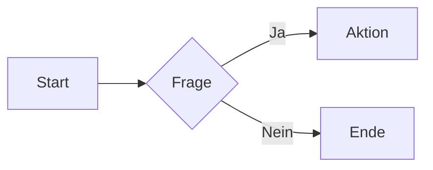

# Willkommen bei MD++

**MD++ (Markdown Plus Plus)** ist ein erweiterter Markdown-Editor mit Live-Vorschau.

| Feature | Beschreibung |
|---------|--------------|
| **AI Context Blocks** | Kontextinformationen für KI-Assistenten einbetten |
| **Component Directives** | Framework-unabhängige UI-Komponenten |
| **Plugin-System** | Erweiterbar durch Bootstrap, Admonitions, etc. |
| **Live-Vorschau** | Änderungen sofort sehen |

> **Tipp:** Einstellungen öffnen mit `Ctrl+,` · Neue Datei mit `Ctrl+N`

---

# Kern-Markdown
*Immer verfügbar*

---

## Fett & Kursiv

**Syntax:**
```markdown
**fetter Text**
*kursiver Text*
***fett und kursiv***
```

**Ausgabe:**

**fetter Text**

*kursiver Text*

***fett und kursiv***

---

## Inline-Code

**Syntax:**
```markdown
Nutze \`console.log()\` zum Debuggen.
```

**Ausgabe:**

Nutze `console.log()` zum Debuggen.

---

## Überschriften

**Syntax:**
```markdown
# Überschrift 1
## Überschrift 2
### Überschrift 3
```

**Ausgabe:**

### Überschrift 3 (Beispiel)

---

## Listen

**Syntax:**
```markdown
- Punkt A
- Punkt B
  - Verschachtelt

1. Erster
2. Zweiter
```

**Ausgabe:**

- Punkt A
- Punkt B
  - Verschachtelt

1. Erster
2. Zweiter

---

## Links

**Syntax:**
```markdown
[GitHub](https://github.com)
```

**Ausgabe:**

[GitHub](https://github.com)

---

## Blockquotes

**Syntax:**
```markdown
> Dies ist ein Zitat.
> Über mehrere Zeilen.
```

**Ausgabe:**

> Dies ist ein Zitat.
> Über mehrere Zeilen.

---

## Code-Blöcke

**Syntax:**
````markdown
```javascript
function greet(name) {
  return `Hello, ${name}!`;
}
```
````

**Ausgabe:**

```javascript
function greet(name) {
  return `Hello, ${name}!`;
}
```

---

# GitHub Flavored Markdown
*Feature: `enableGfm` · Standard: Aktiv*

---

## Tabellen
*Feature: `enableTables`*

**Syntax:**
```markdown
| Links | Zentriert | Rechts |
|:------|:---------:|-------:|
| A     | B         | C      |
```

**Ausgabe:**

| Links | Zentriert | Rechts |
|:------|:---------:|-------:|
| A     | B         | C      |

---

## Task-Listen
*Feature: `enableTaskLists`*

**Syntax:**
```markdown
- [x] Erledigt
- [ ] Offen
```

**Ausgabe:**

- [x] Erledigt
- [ ] Offen

---

## Durchstreichen
*Feature: `enableStrikethrough`*

**Syntax:**
```markdown
~~durchgestrichen~~
```

**Ausgabe:**

~~durchgestrichen~~

---

## Fußnoten
*Feature: `enableFootnotes`*

**Syntax:**
```markdown
Text mit Fußnote[^1].

[^1]: Fußnoteninhalt hier.
```

**Ausgabe:**

Text mit Fußnote[^1].

[^1]: Fußnoteninhalt hier.

---

# Erweiterungen
*Standard: Aktiv*

---

## Mathematische Formeln
*Feature: `enableMath`*

**Syntax (Inline):**
```markdown
Die Formel $E = mc^2$ ist berühmt.
```

**Ausgabe:**

Die Formel $E = mc^2$ ist berühmt.

**Syntax (Block):**
```markdown
$$
\sum_{i=1}^{n} i = \frac{n(n+1)}{2}
$$
```

**Ausgabe:**

$$
\sum_{i=1}^{n} i = \frac{n(n+1)}{2}
$$

---

## Callouts / Hinweisboxen
*Feature: `enableCallouts`*

**Syntax:**
```markdown
> [!NOTE]
> Eine Notiz.

> [!TIP]
> Ein Tipp.

> [!WARNING]
> Eine Warnung.

> [!DANGER]
> Gefahr!
```

**Ausgabe:**

> [!NOTE]
> Eine Notiz.

> [!TIP]
> Ein Tipp.

> [!WARNING]
> Eine Warnung.

> [!DANGER]
> Gefahr!

---

## Mermaid-Diagramme
*Feature: `enableMermaid`*

**Syntax:**
````markdown

````

**Ausgabe:**


---

# MD++ Exklusiv

---

## AI Context Blocks
*Feature: `enableAIContext` · Standard: Aktiv*

Kontext für KI-Assistenten, optional versteckbar.

**Syntax (sichtbar):**
```markdown
:::ai-context{visibility=visible}
Dieser Kontext ist für Menschen und KI sichtbar.
:::
```

**Ausgabe:**

:::ai-context{visibility=visible}
Dieser Kontext ist für Menschen und KI sichtbar.
:::

**Syntax (versteckt):**
```markdown
:::ai-context{visibility=hidden}
Nur für KI sichtbar. Toggle mit Ctrl+Shift+A.
:::
```

**Ausgabe:** *(Versteckt - aktiviere mit Ctrl+Shift+A)*

:::ai-context{visibility=hidden}
Nur für KI sichtbar. Du siehst dies, weil AI-Context aktiv ist.
:::

---

## Component Directives
*Feature: `enableDirectives` · Standard: Aktiv*

UI-Komponenten aus Plugins verwenden.

**Syntax:**
```markdown
:::plugin:component{attribut="wert"}
Inhalt hier
:::
```

---

# Plugin: Bootstrap
*Plugin: `bootstrap` · Standard: Aktiv*

---

## Alert

**Syntax:**
```markdown
:::bootstrap:alert{variant="info"}
Info-Nachricht
:::
```

**Ausgabe:**

:::bootstrap:alert{variant="info"}
Info-Nachricht
:::

**Varianten:** `primary`, `secondary`, `success`, `danger`, `warning`, `info`

:::bootstrap:alert{variant="success"}
Erfolg!
:::

:::bootstrap:alert{variant="warning"}
Warnung!
:::

:::bootstrap:alert{variant="danger"}
Fehler!
:::

---

## Card

**Syntax:**
```markdown
:::bootstrap:card
### Titel
Inhalt mit **Markdown**.
:::
```

**Ausgabe:**

:::bootstrap:card
### Karten-Titel
Inhalt mit **Markdown** und Listen:
- Punkt 1
- Punkt 2
:::

---

# Plugin: Admonitions
*Plugin: `admonitions` · Standard: Aktiv*

---

## Note

**Syntax:**
```markdown
:::admonition{type="note" title="Hinweis"}
Inhalt der Notiz.
:::
```

**Ausgabe:**

:::admonition{type="note" title="Hinweis"}
Inhalt der Notiz.
:::

---

## Tip

**Syntax:**
```markdown
:::admonition{type="tip" title="Tipp"}
Best Practice hier.
:::
```

**Ausgabe:**

:::admonition{type="tip" title="Tipp"}
Best Practice hier.
:::

---

## Warning

**Syntax:**
```markdown
:::admonition{type="warning" title="Achtung"}
Wichtige Warnung.
:::
```

**Ausgabe:**

:::admonition{type="warning" title="Achtung"}
Wichtige Warnung.
:::

---

## Danger

**Syntax:**
```markdown
:::admonition{type="danger" title="Gefahr"}
Kritischer Hinweis!
:::
```

**Ausgabe:**

:::admonition{type="danger" title="Gefahr"}
Kritischer Hinweis!
:::

---

# Optionale Plugins
*In Einstellungen (Ctrl+,) aktivieren*

| Plugin | Beschreibung |
|--------|--------------|
| `katex` | Erweitertes LaTeX-Rendering |
| `mermaid` | Zusätzliche Diagramm-Typen |

---

# Tastenkürzel

| Aktion | Kürzel |
|--------|--------|
| Neue Datei | Ctrl+N |
| Öffnen | Ctrl+O |
| Speichern | Ctrl+S |
| Speichern unter | Ctrl+Shift+S |
| Einstellungen | Ctrl+, |
| AI-Kontext Toggle | Ctrl+Shift+A |
| Nur Editor | Ctrl+1 |
| Nur Vorschau | Ctrl+2 |
| Split-Ansicht | Ctrl+3 |
| Neuer Tab | Ctrl+T |
| Tab schließen | Ctrl+W |
| Nächster Tab | Ctrl+Tab |
| Vorheriger Tab | Ctrl+Shift+Tab |
