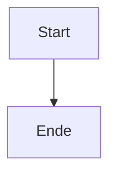
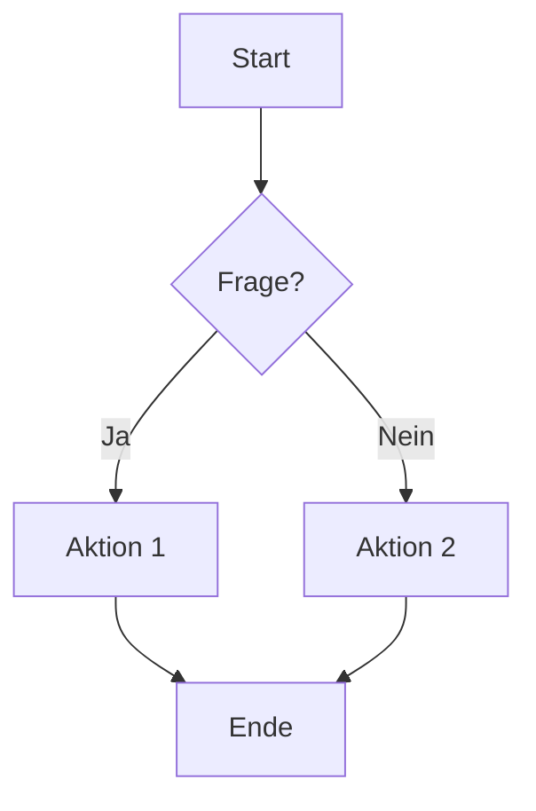
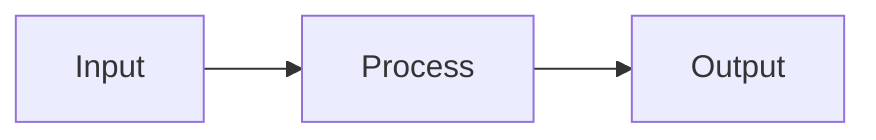
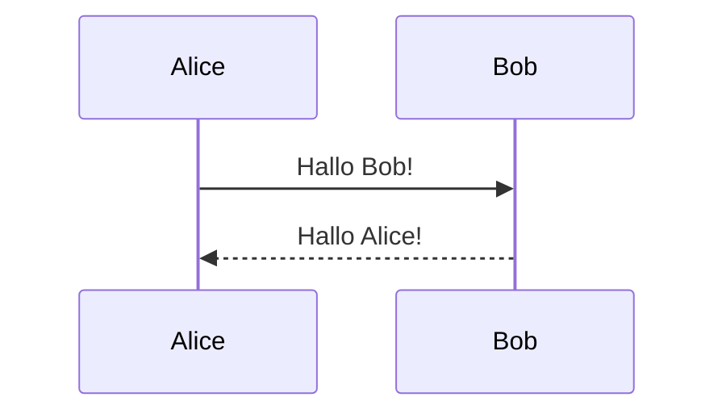
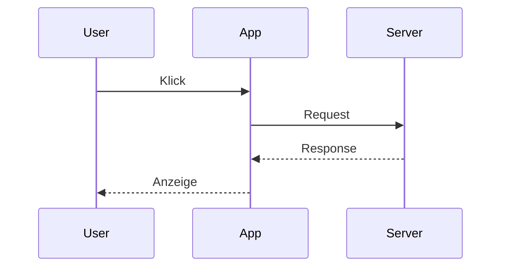
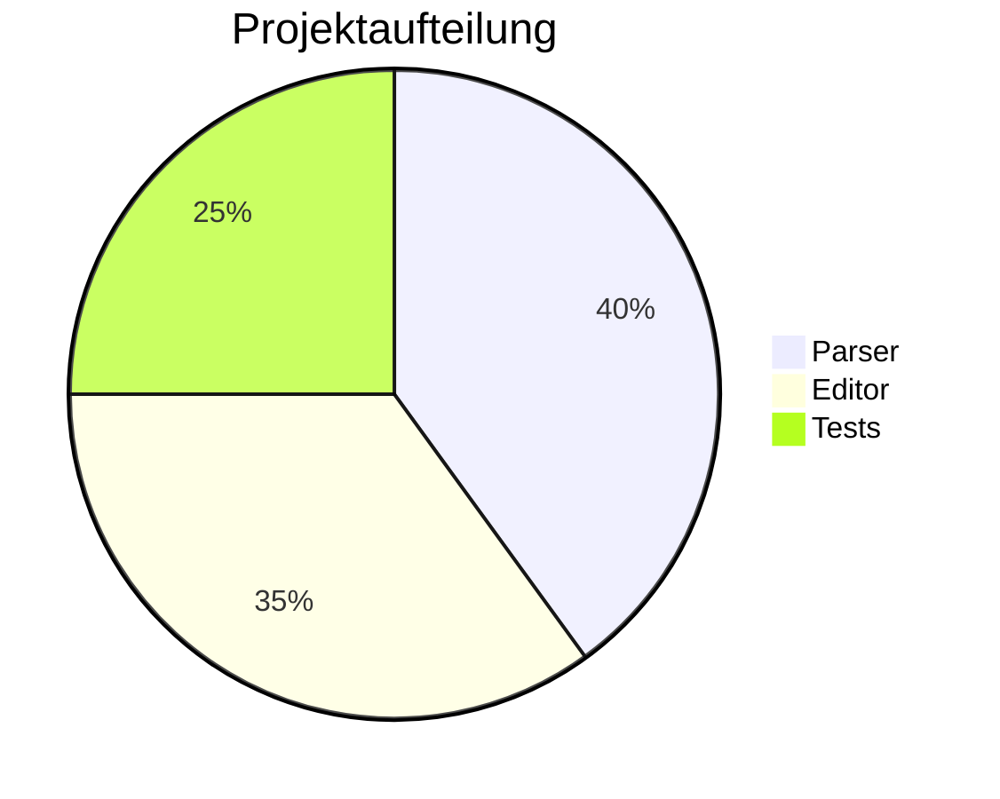
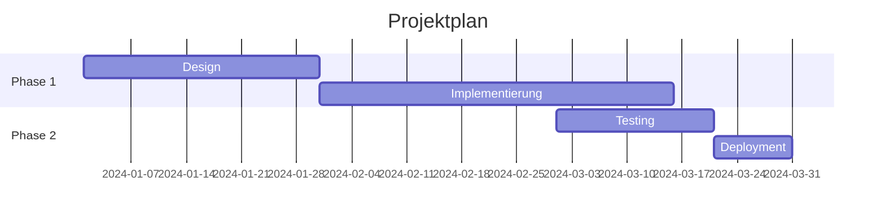
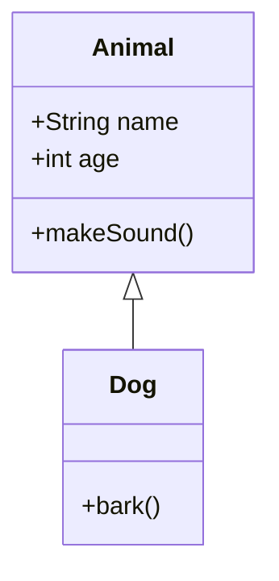
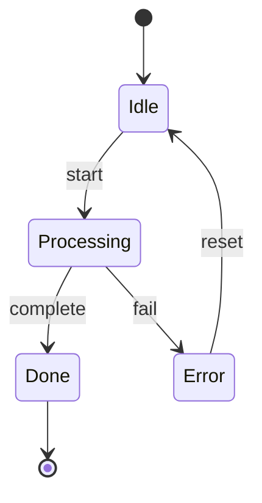
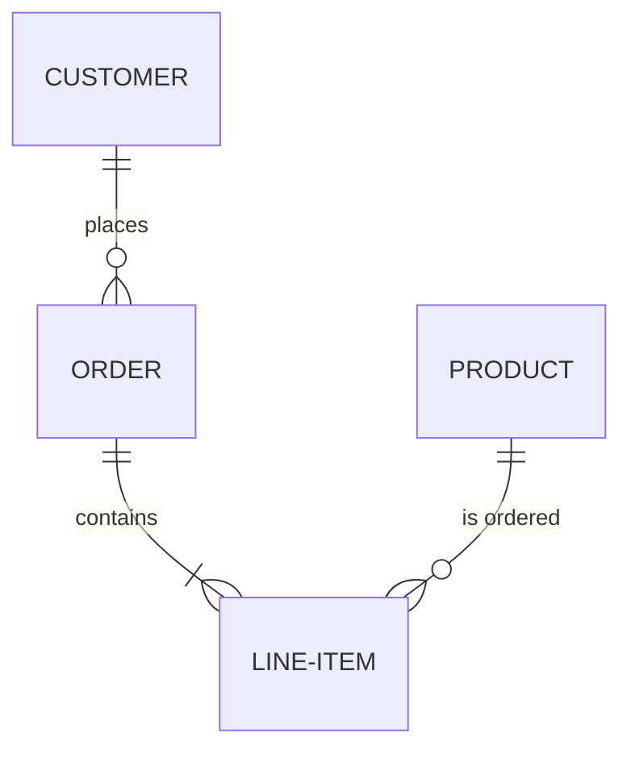

# Test 07: Mermaid Diagramme

> **Kategorie:** Mermaid Diagramme
> **Dateien:**
> - `src/parser.ts` - createCodeBlockPlugin (mermaid handling)
> - `app/renderer/src/components/Preview.tsx` - Mermaid Rendering
> - `app/renderer/src/scss/components/_mermaid.scss` - Mermaid SCSS-Styles
> **Feature:** enableMermaid

---

## 7.1 Flowchart

### Test: Einfacher Flowchart
**Eingabe:**
````markdown

````

**Erwartung:** Zwei Boxen mit Pfeil
**Ergebnis:** [ ] PASS / [ ] FAIL

**Ausgabe:**


---

### Test: Flowchart mit Verzweigung
**Eingabe:**
````markdown

````

**Erwartung:** Raute für Entscheidung, beschriftete Pfeile
**Ergebnis:** [ ] PASS / [ ] FAIL

**Ausgabe:**


---

### Test: Flowchart LR (links-rechts)
**Eingabe:**
````markdown

````

**Erwartung:** Horizontaler Flow
**Ergebnis:** [ ] PASS / [ ] FAIL

**Ausgabe:**


---

## 7.2 Sequenzdiagramm

### Test: Einfaches Sequenzdiagramm
**Eingabe:**
````markdown

````

**Erwartung:** Zwei Teilnehmer mit Nachrichten
**Ergebnis:** [ ] PASS / [ ] FAIL

**Ausgabe:**


---

### Test: Sequenzdiagramm mit Participants
**Eingabe:**
````markdown

````

**Erwartung:** Drei Teilnehmer mit Nachrichtenfluss
**Ergebnis:** [ ] PASS / [ ] FAIL

**Ausgabe:**


---

## 7.3 Pie Chart

### Test: Einfacher Pie Chart
**Eingabe:**
````markdown

````

**Erwartung:** Kreisdiagramm mit 3 Segmenten
**Ergebnis:** [ ] PASS / [ ] FAIL

**Ausgabe:**


---

## 7.4 Gantt Chart

### Test: Gantt Diagramm
**Eingabe:**
````markdown

````

**Erwartung:** Gantt-Chart mit Zeitbalken
**Ergebnis:** [ ] PASS / [ ] FAIL

**Ausgabe:**


---

## 7.5 Class Diagram

### Test: Klassendiagramm
**Eingabe:**
````markdown

````

**Erwartung:** UML-Klassendiagramm mit Vererbung
**Ergebnis:** [ ] PASS / [ ] FAIL

**Ausgabe:**


---

## 7.6 State Diagram

### Test: Zustandsdiagramm
**Eingabe:**
````markdown

````

**Erwartung:** Zustandsdiagramm mit Übergängen
**Ergebnis:** [ ] PASS / [ ] FAIL

**Ausgabe:**


---

## 7.7 ER Diagram

### Test: Entity-Relationship Diagramm
**Eingabe:**
````markdown

````

**Erwartung:** ER-Diagramm mit Beziehungen
**Ergebnis:** [ ] PASS / [ ] FAIL

**Ausgabe:**


---

## 7.8 Mindmap

### Test: Mindmap
**Eingabe:**
````markdown
```mermaid
mindmap
  root((MD++))
    Parser
      Markdown
      Directives
      Plugins
    Editor
      Monaco
      WYSIWYG
    Preview
      HTML
      Mermaid
      KaTeX
```
````

**Erwartung:** Mindmap mit zentralem Knoten
**Ergebnis:** [ ] PASS / [ ] FAIL

**Ausgabe:**
```mermaid
mindmap
  root((MD++))
    Parser
      Markdown
      Directives
      Plugins
    Editor
      Monaco
      WYSIWYG
    Preview
      HTML
      Mermaid
      KaTeX
```

---

## 7.9 Edge Cases

### Test: Syntax-Fehler
**Eingabe:**
````markdown
```mermaid
flowchart INVALID
    broken syntax here
```
````

**Erwartung:** Fehler wird angezeigt (kein Crash)
**Ergebnis:** [ ] PASS / [ ] FAIL

**Ausgabe:**
```mermaid
flowchart INVALID
    broken syntax here
```

---

### Test: Leeres Mermaid
**Eingabe:**
````markdown
```mermaid
```
````

**Erwartung:** Kein Crash, evtl. leere Ausgabe
**Ergebnis:** [ ] PASS / [ ] FAIL

**Ausgabe:**
```mermaid
```

---

### Test: Mermaid mit Sonderzeichen
**Eingabe:**
````markdown
```mermaid
flowchart LR
    A["Start (Anfang)"] --> B["Ende & Schluss"]
```
````

**Erwartung:** Sonderzeichen in Anführungszeichen
**Ergebnis:** [ ] PASS / [ ] FAIL

**Ausgabe:**
```mermaid
flowchart LR
    A["Start (Anfang)"] --> B["Ende & Schluss"]
```

---

## Zusammenfassung

| Test | Status | Problem-Datei |
|------|--------|---------------|
| 7.1 Flowchart Einfach | [ ] | |
| 7.1 Flowchart Verzweigung | [ ] | |
| 7.1 Flowchart LR | [ ] | |
| 7.2 Sequenz Einfach | [ ] | |
| 7.2 Sequenz Participants | [ ] | |
| 7.3 Pie Chart | [ ] | |
| 7.4 Gantt | [ ] | |
| 7.5 Class Diagram | [ ] | |
| 7.6 State Diagram | [ ] | |
| 7.7 ER Diagram | [ ] | |
| 7.8 Mindmap | [ ] | |
| 7.9 Syntax-Fehler | [ ] | |
| 7.9 Leeres Mermaid | [ ] | |
| 7.9 Sonderzeichen | [ ] | |

**Gesamt:** ____ / 14 PASS

---

## Bekannte Probleme bei diesem Test

| Problem | Datei zum Bearbeiten |
|---------|---------------------|
| | |
