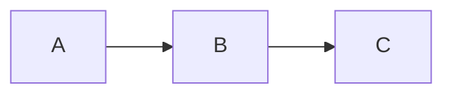
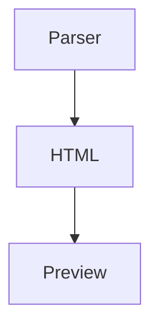

# Test 09: Gemischte Inhalte

> **Kategorie:** Integration aller Features
> **Dateien:** Alle Parser- und Renderer-Dateien
> **Feature:** Kombination aller Features

---

## 9.1 Admonition mit Code

### Test: Code in Admonition
**Eingabe:**
```markdown
:::tip
Hier ist ein Code-Beispiel:

```javascript
const greeting = "Hello World";
console.log(greeting);
```

So wird es gemacht!
:::
```

**Erwartung:** Code-Block innerhalb der Admonition
**Ergebnis:** [ ] PASS / [ ] FAIL

**Ausgabe:**
:::tip
Hier ist ein Code-Beispiel:

```javascript
const greeting = "Hello World";
console.log(greeting);
```

So wird es gemacht!
:::

---

## 9.2 Admonition mit Mermaid

### Test: Mermaid in Admonition
**Eingabe:**
```markdown
:::note
Hier ist ein Diagramm:



Das zeigt den Flow.
:::
```

**Erwartung:** Mermaid-Diagramm in Admonition
**Ergebnis:** [ ] PASS / [ ] FAIL

**Ausgabe:**
:::note
Hier ist ein Diagramm:


Das zeigt den Flow.
:::

---

## 9.3 Admonition mit Tabelle

### Test: Tabelle in Admonition
**Eingabe:**
```markdown
:::warning
**Wichtige Konfiguration:**

| Option | Wert | Beschreibung |
|--------|------|--------------|
| debug | true | Aktiviert Debug-Modus |
| timeout | 5000 | Timeout in ms |

Bitte beachten!
:::
```

**Erwartung:** Tabelle in Admonition
**Ergebnis:** [ ] PASS / [ ] FAIL

**Ausgabe:**
:::warning
**Wichtige Konfiguration:**

| Option | Wert | Beschreibung |
|--------|------|--------------|
| debug | true | Aktiviert Debug-Modus |
| timeout | 5000 | Timeout in ms |

Bitte beachten!
:::

---

## 9.4 Bootstrap Card mit komplexem Inhalt

### Test: Vollständige Card
**Eingabe:**
```markdown
:::card{.shadow}
### Feature: AI Context

Ermöglicht das Einbetten von KI-Kontext.

**Vorteile:**
- Versteckte Informationen für AI
- Sichtbare Kontext-Blöcke
- Toggle mit `Ctrl+Shift+A`

:::alert{variant="info"}
Tipp: Nutze `visibility=hidden` für versteckten Kontext.
:::

```javascript
:::ai-context{visibility=hidden}
Nur für AI sichtbar.
:::
```
:::
```

**Erwartung:** Card mit verschachteltem Alert und Code
**Ergebnis:** [ ] PASS / [ ] FAIL

**Ausgabe:**
:::card{.shadow}
### Feature: AI Context

Ermöglicht das Einbetten von KI-Kontext.

**Vorteile:**
- Versteckte Informationen für AI
- Sichtbare Kontext-Blöcke
- Toggle mit `Ctrl+Shift+A`

:::alert{variant="info"}
Tipp: Nutze `visibility=hidden` für versteckten Kontext.
:::

```javascript
:::ai-context{visibility=hidden}
Nur für AI sichtbar.
:::
```
:::

---

## 9.5 Math mit Text

### Test: Mathematik in Fließtext
**Eingabe:**
```markdown
Die Formel $E = mc^2$ zeigt, dass Energie ($E$) gleich Masse ($m$)
mal Lichtgeschwindigkeit zum Quadrat ($c^2$) ist.

Die vollständige Ableitung:

$$
E = mc^2 = m \cdot (3 \times 10^8 \text{ m/s})^2
$$

Das ergibt eine enorme Energie!
```

**Erwartung:** Inline und Block-Mathe gemischt
**Ergebnis:** [ ] PASS / [ ] FAIL

**Ausgabe:**
Die Formel $E = mc^2$ zeigt, dass Energie ($E$) gleich Masse ($m$)
mal Lichtgeschwindigkeit zum Quadrat ($c^2$) ist.

Die vollständige Ableitung:

$$
E = mc^2 = m \cdot (3 \times 10^8 \text{ m/s})^2
$$

Das ergibt eine enorme Energie!

---

## 9.6 Alles zusammen

### Test: Dokument mit allen Features
**Eingabe:**

# Komplettes Dokument

## Einleitung

Dies ist ein **komplettes** Dokument mit *allen* Features.

> [!NOTE]
> Hier ist ein GitHub-Style Callout.

### Code-Beispiel

```typescript
interface Parser {
  convert(markdown: string): Promise<Result>;
}
```

### Mathematik

Die Summe: $\sum_{i=1}^n i = \frac{n(n+1)}{2}$

$$
\int_0^\infty e^{-x^2} dx = \frac{\sqrt{\pi}}{2}
$$

### Diagramm



### Tabelle

| Feature | Status |
|---------|--------|
| Parser | ✅ |
| Editor | ✅ |
| Preview | ✅ |

### AI-Kontext

:::ai-context{visibility=visible}
Dieser Block ist für Menschen und AI sichtbar.
:::

### Fußnote

Text mit Fußnote[^1].

[^1]: Dies ist die Fußnote.

---

**Erwartung:** Alle Features korrekt gerendert
**Ergebnis:** [ ] PASS / [ ] FAIL

---

## Zusammenfassung

| Test | Status | Problem-Datei |
|------|--------|---------------|
| 9.1 Admonition+Code | [ ] | |
| 9.2 Admonition+Mermaid | [ ] | |
| 9.3 Admonition+Tabelle | [ ] | |
| 9.4 Card komplex | [ ] | |
| 9.5 Math+Text | [ ] | |
| 9.6 Alles zusammen | [ ] | |

**Gesamt:** ____ / 6 PASS

---

## Bekannte Probleme bei diesem Test

| Problem | Datei zum Bearbeiten |
|---------|---------------------|
| | |
