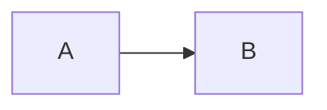

# Test 10: Grenzfälle und Edge Cases

> **Kategorie:** Robustheit und Fehlerbehandlung
> **Dateien:** Alle Parser-Dateien
> **Feature:** Fehlertoleranz

---

## 10.1 Ungeschlossene Directives

### Test: Nicht geschlossene Admonition
**Eingabe:**
```markdown
:::note
Dies ist nicht geschlossen.

Normaler Text danach.
```

**Erwartung:** Kein Crash, sinnvolle Ausgabe
**Ergebnis:** [ ] PASS / [ ] FAIL

**Ausgabe:**
:::note
Dies ist nicht geschlossen.

Normaler Text danach.

---

### Test: Doppelt geschlossen
**Eingabe:**
```markdown
:::warning
Warnung
:::
:::
```

**Erwartung:** Erste Schließung zählt, extra ::: ignoriert
**Ergebnis:** [ ] PASS / [ ] FAIL

**Ausgabe:**
:::warning
Warnung
:::
:::

---

## 10.2 Leere Blöcke

### Test: Leere Admonition
**Eingabe:**
```markdown
:::note
:::
```

**Erwartung:** Leere Box ohne Fehler
**Ergebnis:** [ ] PASS / [ ] FAIL

**Ausgabe:**
:::note
:::

---

### Test: Nur Leerzeichen in Admonition
**Eingabe:**
```markdown
:::tip

:::
```

**Erwartung:** Leerraum erhalten oder ignoriert
**Ergebnis:** [ ] PASS / [ ] FAIL

**Ausgabe:**
:::tip

:::

---

## 10.3 Verschachtelung

### Test: Tiefe Verschachtelung
**Eingabe:**
```markdown
:::card
:::alert{variant="info"}
:::note
Tief verschachtelt
:::
:::
:::
```

**Erwartung:** Dreifach verschachtelte Blöcke
**Ergebnis:** [ ] PASS / [ ] FAIL

**Ausgabe:**
:::card
:::alert{variant="info"}
:::note
Tief verschachtelt
:::
:::
:::

---

### Test: Verschachtelte Blockquotes in Admonition
**Eingabe:**
```markdown
:::note
> Zitat in Note
>> Verschachteltes Zitat
> Zurück
:::
```

**Erwartung:** Blockquotes innerhalb funktionieren
**Ergebnis:** [ ] PASS / [ ] FAIL

**Ausgabe:**
:::note
> Zitat in Note
>> Verschachteltes Zitat
> Zurück
:::

---

## 10.4 Ungültige Syntax

### Test: Unbekanntes Plugin
**Eingabe:**
```markdown
:::unknown_plugin_test
Inhalt
:::
```

**Erwartung:** Fehler oder Fallback, kein Crash
**Ergebnis:** [ ] PASS / [ ] FAIL

**Ausgabe:**
:::unknown_plugin_test
Inhalt
:::

---

### Test: Ungültige Attribute
**Eingabe:**
```markdown
:::alert{variant=invalid variant="also invalid" broken}
Inhalt
:::
```

**Erwartung:** Attribut-Parsing tolerant
**Ergebnis:** [ ] PASS / [ ] FAIL

**Ausgabe:**
:::alert{variant=invalid variant="also invalid" broken}
Inhalt
:::

---

### Test: Nur Doppelpunkte
**Eingabe:**
```markdown
:::
Inhalt
:::
```

**Erwartung:** Kein Crash, evtl. als Paragraph
**Ergebnis:** [ ] PASS / [ ] FAIL

**Ausgabe:**
:::
Inhalt
:::

---

## 10.5 Sonderzeichen

### Test: Unicode in Directives
**Eingabe:**
```markdown
:::note
日本語テキスト
Emoji: 🚀 🎉 ✨
Umlaute: äöüß ÄÖÜ
:::
```

**Erwartung:** Unicode korrekt dargestellt
**Ergebnis:** [ ] PASS / [ ] FAIL

**Ausgabe:**
:::note
日本語テキスト
Emoji: 🚀 🎉 ✨
Umlaute: äöüß ÄÖÜ
:::

---

### Test: HTML-Entities
**Eingabe:**
```markdown
:::warning
Sonderzeichen: &lt; &gt; &amp; &quot;
Und: < > & "
:::
```

**Erwartung:** Entities und Zeichen korrekt escaped
**Ergebnis:** [ ] PASS / [ ] FAIL

**Ausgabe:**
:::warning
Sonderzeichen: &lt; &gt; &amp; &quot;
Und: < > & "
:::

---

### Test: Backslash
**Eingabe:**
```markdown
:::note
Pfad: C:\Users\Test\Documents
Escaped: \\server\share
:::
```

**Erwartung:** Backslashes erhalten
**Ergebnis:** [ ] PASS / [ ] FAIL

**Ausgabe:**
:::note
Pfad: C:\Users\Test\Documents
Escaped: \\server\share
:::

---

## 10.6 Lange Inhalte

### Test: Sehr lange Zeile
**Eingabe:**
```markdown
:::note
DiesIstEineSehrLangeZeileOhneLeerzreichenDieVielleichtProblemeVerursachtWennSieNichtRichtigUmgebrochenWirdUndDerBrowserOderRendererDamitNichtKlarkommt
:::
```

**Erwartung:** Umbruch oder Scrollen
**Ergebnis:** [ ] PASS / [ ] FAIL

**Ausgabe:**
:::note
DiesIstEineSehrLangeZeileOhneLeerzreichenDieVielleichtProblemeVerursachtWennSieNichtRichtigUmgebrochenWirdUndDerBrowserOderRendererDamitNichtKlarkommt
:::

---

### Test: Viele Zeilen
**Eingabe:**
```markdown
:::note
Zeile 1
Zeile 2
Zeile 3
Zeile 4
Zeile 5
Zeile 6
Zeile 7
Zeile 8
Zeile 9
Zeile 10
:::
```

**Erwartung:** Alle Zeilen angezeigt
**Ergebnis:** [ ] PASS / [ ] FAIL

**Ausgabe:**
:::note
Zeile 1
Zeile 2
Zeile 3
Zeile 4
Zeile 5
Zeile 6
Zeile 7
Zeile 8
Zeile 9
Zeile 10
:::

---

## 10.7 Kombination mit anderen Features

### Test: Tabelle nach Admonition
**Eingabe:**
```markdown
:::note
Notiz hier.
:::

| A | B |
|---|---|
| 1 | 2 |
```

**Erwartung:** Beide richtig gerendert
**Ergebnis:** [ ] PASS / [ ] FAIL

**Ausgabe:**
:::note
Notiz hier.
:::

| A | B |
|---|---|
| 1 | 2 |

---

### Test: Admonition nach Mermaid
**Eingabe:**
````markdown


:::tip
Das war ein Diagramm!
:::
````

**Erwartung:** Beide richtig gerendert
**Ergebnis:** [ ] PASS / [ ] FAIL

**Ausgabe:**


:::tip
Das war ein Diagramm!
:::

---

## Zusammenfassung

| Test | Status | Problem-Datei |
|------|--------|---------------|
| 10.1 Ungeschlossen | [ ] | |
| 10.1 Doppelt geschlossen | [ ] | |
| 10.2 Leere Admonition | [ ] | |
| 10.2 Nur Leerzeichen | [ ] | |
| 10.3 Tiefe Verschachtelung | [ ] | |
| 10.3 Blockquotes in Admonition | [ ] | |
| 10.4 Unbekanntes Plugin | [ ] | |
| 10.4 Ungültige Attribute | [ ] | |
| 10.4 Nur ::: | [ ] | |
| 10.5 Unicode | [ ] | |
| 10.5 HTML-Entities | [ ] | |
| 10.5 Backslash | [ ] | |
| 10.6 Lange Zeile | [ ] | |
| 10.6 Viele Zeilen | [ ] | |
| 10.7 Tabelle nach Admonition | [ ] | |
| 10.7 Admonition nach Mermaid | [ ] | |

**Gesamt:** ____ / 16 PASS

---

## Bekannte Probleme bei diesem Test

| Problem | Datei zum Bearbeiten |
|---------|---------------------|
| | |
